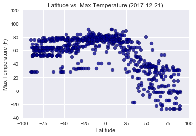
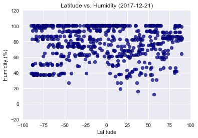
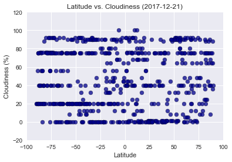
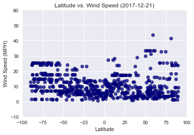

Analysis:
1. As the latitude moves closer to the equator, temperature increases.
2. There seems to be no discernible trend concerning a cities latitude in relation to its wind speed or cloudiness.
3. Just because a country is closer to the equator and has a warmer temperature, does not necessarily mean the humidity is more. In fact, the humidity is higher in places that could be considered colder, like the poles. 


```python
from citipy import citipy
import pandas as pd
import matplotlib.pyplot as plt
import requests
import json
import seaborn as sns
import numpy as np
import datetime 
today = datetime.datetime.today().strftime('%Y-%m-%d')

```


```python
#Configure api
#OpenWeatherMap Api Key
key = "e7604e67af391c6626ebac727adc2e59"
url = "http://api.openweathermap.org/data/2.5/weather?"
units = "Imperial" 
```


```python
#Set up list of randomly generated longitude and latitude
citydf = pd.DataFrame()
citydf["Latitude"] = [(np.random.uniform(-90, 90)) for x in range (700)]
citydf["Longitude"]  = [(np.random.uniform(-180, 180)) for x in range (700)]

city_list = []
country_list = []
for index, row in citydf.iterrows():
    city=citipy.nearest_city(row["Latitude"],row["Longitude"])
    city_list.append(city.city_name)
    country_list.append(city.country_code)
citydf["City"] = city_list
citydf["Country"] = country_list

citydf.head()
```


<div>

<table border="1" class="dataframe">
  <thead>
    <tr style="text-align: right;">
      <th></th>
      <th>Latitude</th>
      <th>Longitude</th>
      <th>City</th>
      <th>Country</th>
    </tr>
  </thead>
  <tbody>
    <tr>
      <th>0</th>
      <td>-1.546541</td>
      <td>-142.544766</td>
      <td>atuona</td>
      <td>pf</td>
    </tr>
    <tr>
      <th>1</th>
      <td>82.896223</td>
      <td>117.404852</td>
      <td>saskylakh</td>
      <td>ru</td>
    </tr>
    <tr>
      <th>2</th>
      <td>24.194745</td>
      <td>-6.346182</td>
      <td>taoudenni</td>
      <td>ml</td>
    </tr>
    <tr>
      <th>3</th>
      <td>-14.865661</td>
      <td>-34.026929</td>
      <td>conde</td>
      <td>br</td>
    </tr>
    <tr>
      <th>4</th>
      <td>-78.928112</td>
      <td>-42.655207</td>
      <td>ushuaia</td>
      <td>ar</td>
    </tr>
  </tbody>
</table>
</div>


# Perform API Calls


```python
# Create empty columnns for data
citydf["Cloudiness"] = ""
citydf["Date"] = ""
citydf["Humidity"] = ""
citydf["Max Temp"] = ""
citydf["Wind Speed"] = ""


# Counter
row_count = 0

# Loop through 
for index, row in citydf.iterrows():
     
    # Create endpoint url 
    city = row["City"]
    target_url = url + "&units=" + units + "&appid=" + key + "&q=" + city

    # Print log to ensure loop is working correctly
    print("Now retrieving city # " + str(row_count))
    print(target_url)
    row_count += 1

    data = requests.get(target_url).json()
    try:
        clouds = data['clouds']['all']
        date = data['dt']
        humidity = data['main']['humidity']
        temp = data['main']['temp_max']
        wind = data['wind']['speed']
        citydf.set_value(index, "Cloudiness", clouds)
        citydf.set_value(index, "Date", date)
        citydf.set_value(index, "Humidity", humidity)
        citydf.set_value(index, "Max Temp", temp)
        citydf.set_value(index, "Wind Speed", wind)
    except:
        print("Missing Data")

```

    Now retrieving city # 0
    http://api.openweathermap.org/data/2.5/weather?&units=Imperial&appid=e7604e67af391c6626ebac727adc2e59&q=atuona
    Now retrieving city # 1
    http://api.openweathermap.org/data/2.5/weather?&units=Imperial&appid=e7604e67af391c6626ebac727adc2e59&q=saskylakh
    Now retrieving city # 2
    http://api.openweathermap.org/data/2.5/weather?&units=Imperial&appid=e7604e67af391c6626ebac727adc2e59&q=taoudenni
    Now retrieving city # 3
    http://api.openweathermap.org/data/2.5/weather?&units=Imperial&appid=e7604e67af391c6626ebac727adc2e59&q=conde
    Now retrieving city # 4
    http://api.openweathermap.org/data/2.5/weather?&units=Imperial&appid=e7604e67af391c6626ebac727adc2e59&q=ushuaia
    Now retrieving city # 5
    http://api.openweathermap.org/data/2.5/weather?&units=Imperial&appid=e7604e67af391c6626ebac727adc2e59&q=aflu
    Missing Data
    Now retrieving city # 6
    http://api.openweathermap.org/data/2.5/weather?&units=Imperial&appid=e7604e67af391c6626ebac727adc2e59&q=lebu
    Now retrieving city # 7
    http://api.openweathermap.org/data/2.5/weather?&units=Imperial&appid=e7604e67af391c6626ebac727adc2e59&q=naze
    Now retrieving city # 8
    http://api.openweathermap.org/data/2.5/weather?&units=Imperial&appid=e7604e67af391c6626ebac727adc2e59&q=dikson
    Now retrieving city # 9
    http://api.openweathermap.org/data/2.5/weather?&units=Imperial&appid=e7604e67af391c6626ebac727adc2e59&q=busselton
    Now retrieving city # 10
    http://api.openweathermap.org/data/2.5/weather?&units=Imperial&appid=e7604e67af391c6626ebac727adc2e59&q=jamestown
    Now retrieving city # 11
    http://api.openweathermap.org/data/2.5/weather?&units=Imperial&appid=e7604e67af391c6626ebac727adc2e59&q=mataura
    Missing Data
    Now retrieving city # 12
    http://api.openweathermap.org/data/2.5/weather?&units=Imperial&appid=e7604e67af391c6626ebac727adc2e59&q=cape town
    Now retrieving city # 13
    http://api.openweathermap.org/data/2.5/weather?&units=Imperial&appid=e7604e67af391c6626ebac727adc2e59&q=rikitea
    Now retrieving city # 14
    http://api.openweathermap.org/data/2.5/weather?&units=Imperial&appid=e7604e67af391c6626ebac727adc2e59&q=souillac
    Now retrieving city # 15
    http://api.openweathermap.org/data/2.5/weather?&units=Imperial&appid=e7604e67af391c6626ebac727adc2e59&q=matara
    Now retrieving city # 16
    http://api.openweathermap.org/data/2.5/weather?&units=Imperial&appid=e7604e67af391c6626ebac727adc2e59&q=dingzhou
    Now retrieving city # 17
    http://api.openweathermap.org/data/2.5/weather?&units=Imperial&appid=e7604e67af391c6626ebac727adc2e59&q=pacific grove
    Now retrieving city # 18
    http://api.openweathermap.org/data/2.5/weather?&units=Imperial&appid=e7604e67af391c6626ebac727adc2e59&q=bluff
    Now retrieving city # 19
    http://api.openweathermap.org/data/2.5/weather?&units=Imperial&appid=e7604e67af391c6626ebac727adc2e59&q=esperance
    Now retrieving city # 20
    http://api.openweathermap.org/data/2.5/weather?&units=Imperial&appid=e7604e67af391c6626ebac727adc2e59&q=longyearbyen
    Now retrieving city # 21
    http://api.openweathermap.org/data/2.5/weather?&units=Imperial&appid=e7604e67af391c6626ebac727adc2e59&q=ponta do sol
    Now retrieving city # 22
    http://api.openweathermap.org/data/2.5/weather?&units=Imperial&appid=e7604e67af391c6626ebac727adc2e59&q=bluff
    Now retrieving city # 23
    http://api.openweathermap.org/data/2.5/weather?&units=Imperial&appid=e7604e67af391c6626ebac727adc2e59&q=mount gambier
    Now retrieving city # 24
    http://api.openweathermap.org/data/2.5/weather?&units=Imperial&appid=e7604e67af391c6626ebac727adc2e59&q=griffith
    Now retrieving city # 25
    http://api.openweathermap.org/data/2.5/weather?&units=Imperial&appid=e7604e67af391c6626ebac727adc2e59&q=hilo
    Now retrieving city # 26
    http://api.openweathermap.org/data/2.5/weather?&units=Imperial&appid=e7604e67af391c6626ebac727adc2e59&q=bluff
    Now retrieving city # 27
    http://api.openweathermap.org/data/2.5/weather?&units=Imperial&appid=e7604e67af391c6626ebac727adc2e59&q=lebu
    Now retrieving city # 28
    http://api.openweathermap.org/data/2.5/weather?&units=Imperial&appid=e7604e67af391c6626ebac727adc2e59&q=sovkhoznyy
    Now retrieving city # 29
    http://api.openweathermap.org/data/2.5/weather?&units=Imperial&appid=e7604e67af391c6626ebac727adc2e59&q=whitehorse
    Now retrieving city # 30
    http://api.openweathermap.org/data/2.5/weather?&units=Imperial&appid=e7604e67af391c6626ebac727adc2e59&q=atuona
    Now retrieving city # 31
    http://api.openweathermap.org/data/2.5/weather?&units=Imperial&appid=e7604e67af391c6626ebac727adc2e59&q=bereda
    Missing Data
    Now retrieving city # 32
    http://api.openweathermap.org/data/2.5/weather?&units=Imperial&appid=e7604e67af391c6626ebac727adc2e59&q=kapaa
    Now retrieving city # 33
    http://api.openweathermap.org/data/2.5/weather?&units=Imperial&appid=e7604e67af391c6626ebac727adc2e59&q=cape town
    Now retrieving city # 34
    http://api.openweathermap.org/data/2.5/weather?&units=Imperial&appid=e7604e67af391c6626ebac727adc2e59&q=dubbo
    Now retrieving city # 35
    http://api.openweathermap.org/data/2.5/weather?&units=Imperial&appid=e7604e67af391c6626ebac727adc2e59&q=mantsala
    Now retrieving city # 36
    http://api.openweathermap.org/data/2.5/weather?&units=Imperial&appid=e7604e67af391c6626ebac727adc2e59&q=port elizabeth
    Now retrieving city # 37
    http://api.openweathermap.org/data/2.5/weather?&units=Imperial&appid=e7604e67af391c6626ebac727adc2e59&q=tuktoyaktuk
    Now retrieving city # 38
    http://api.openweathermap.org/data/2.5/weather?&units=Imperial&appid=e7604e67af391c6626ebac727adc2e59&q=mushie
    Now retrieving city # 39
    http://api.openweathermap.org/data/2.5/weather?&units=Imperial&appid=e7604e67af391c6626ebac727adc2e59&q=longkou
    Now retrieving city # 40
    http://api.openweathermap.org/data/2.5/weather?&units=Imperial&appid=e7604e67af391c6626ebac727adc2e59&q=adrar
    Now retrieving city # 41
    http://api.openweathermap.org/data/2.5/weather?&units=Imperial&appid=e7604e67af391c6626ebac727adc2e59&q=ushuaia
    Now retrieving city # 42
    http://api.openweathermap.org/data/2.5/weather?&units=Imperial&appid=e7604e67af391c6626ebac727adc2e59&q=saint-philippe
    Now retrieving city # 43
    http://api.openweathermap.org/data/2.5/weather?&units=Imperial&appid=e7604e67af391c6626ebac727adc2e59&q=crab hill
    Missing Data
    Now retrieving city # 44
    http://api.openweathermap.org/data/2.5/weather?&units=Imperial&appid=e7604e67af391c6626ebac727adc2e59&q=busselton
    Now retrieving city # 45
    http://api.openweathermap.org/data/2.5/weather?&units=Imperial&appid=e7604e67af391c6626ebac727adc2e59&q=bluff
    Now retrieving city # 46
    http://api.openweathermap.org/data/2.5/weather?&units=Imperial&appid=e7604e67af391c6626ebac727adc2e59&q=rikitea
    Now retrieving city # 47
    http://api.openweathermap.org/data/2.5/weather?&units=Imperial&appid=e7604e67af391c6626ebac727adc2e59&q=taolanaro
    Missing Data
    Now retrieving city # 48
    http://api.openweathermap.org/data/2.5/weather?&units=Imperial&appid=e7604e67af391c6626ebac727adc2e59&q=cabo san lucas
    Now retrieving city # 49
    http://api.openweathermap.org/data/2.5/weather?&units=Imperial&appid=e7604e67af391c6626ebac727adc2e59&q=hobart
    Now retrieving city # 50
    http://api.openweathermap.org/data/2.5/weather?&units=Imperial&appid=e7604e67af391c6626ebac727adc2e59&q=port alfred
    Now retrieving city # 51
    http://api.openweathermap.org/data/2.5/weather?&units=Imperial&appid=e7604e67af391c6626ebac727adc2e59&q=busselton
    Now retrieving city # 52
    http://api.openweathermap.org/data/2.5/weather?&units=Imperial&appid=e7604e67af391c6626ebac727adc2e59&q=cape town
    Now retrieving city # 53
    http://api.openweathermap.org/data/2.5/weather?&units=Imperial&appid=e7604e67af391c6626ebac727adc2e59&q=saint-philippe
    Now retrieving city # 54
    http://api.openweathermap.org/data/2.5/weather?&units=Imperial&appid=e7604e67af391c6626ebac727adc2e59&q=san cristobal
    Now retrieving city # 55
    http://api.openweathermap.org/data/2.5/weather?&units=Imperial&appid=e7604e67af391c6626ebac727adc2e59&q=bethel
    Now retrieving city # 56
    http://api.openweathermap.org/data/2.5/weather?&units=Imperial&appid=e7604e67af391c6626ebac727adc2e59&q=oga
    Missing Data
    Now retrieving city # 57
    http://api.openweathermap.org/data/2.5/weather?&units=Imperial&appid=e7604e67af391c6626ebac727adc2e59&q=east london
    Now retrieving city # 58
    http://api.openweathermap.org/data/2.5/weather?&units=Imperial&appid=e7604e67af391c6626ebac727adc2e59&q=taolanaro
    Missing Data
    Now retrieving city # 59
    http://api.openweathermap.org/data/2.5/weather?&units=Imperial&appid=e7604e67af391c6626ebac727adc2e59&q=alugan
    Now retrieving city # 60
    http://api.openweathermap.org/data/2.5/weather?&units=Imperial&appid=e7604e67af391c6626ebac727adc2e59&q=longyearbyen
    Now retrieving city # 61
    http://api.openweathermap.org/data/2.5/weather?&units=Imperial&appid=e7604e67af391c6626ebac727adc2e59&q=maragogi
    Now retrieving city # 62
    http://api.openweathermap.org/data/2.5/weather?&units=Imperial&appid=e7604e67af391c6626ebac727adc2e59&q=ushuaia
    Now retrieving city # 63
    http://api.openweathermap.org/data/2.5/weather?&units=Imperial&appid=e7604e67af391c6626ebac727adc2e59&q=salalah
    Now retrieving city # 64
    http://api.openweathermap.org/data/2.5/weather?&units=Imperial&appid=e7604e67af391c6626ebac727adc2e59&q=port alfred
    Now retrieving city # 65
    http://api.openweathermap.org/data/2.5/weather?&units=Imperial&appid=e7604e67af391c6626ebac727adc2e59&q=carutapera
    Now retrieving city # 66
    http://api.openweathermap.org/data/2.5/weather?&units=Imperial&appid=e7604e67af391c6626ebac727adc2e59&q=jamestown
    Now retrieving city # 67
    http://api.openweathermap.org/data/2.5/weather?&units=Imperial&appid=e7604e67af391c6626ebac727adc2e59&q=hastings
    Now retrieving city # 68
    http://api.openweathermap.org/data/2.5/weather?&units=Imperial&appid=e7604e67af391c6626ebac727adc2e59&q=coos bay
    Now retrieving city # 69
    http://api.openweathermap.org/data/2.5/weather?&units=Imperial&appid=e7604e67af391c6626ebac727adc2e59&q=hermanus
    Now retrieving city # 70
    http://api.openweathermap.org/data/2.5/weather?&units=Imperial&appid=e7604e67af391c6626ebac727adc2e59&q=yellowknife
    Now retrieving city # 71
    http://api.openweathermap.org/data/2.5/weather?&units=Imperial&appid=e7604e67af391c6626ebac727adc2e59&q=hambantota
    Now retrieving city # 72
    http://api.openweathermap.org/data/2.5/weather?&units=Imperial&appid=e7604e67af391c6626ebac727adc2e59&q=nanortalik
    Now retrieving city # 73
    http://api.openweathermap.org/data/2.5/weather?&units=Imperial&appid=e7604e67af391c6626ebac727adc2e59&q=yellowknife
    Now retrieving city # 74
    http://api.openweathermap.org/data/2.5/weather?&units=Imperial&appid=e7604e67af391c6626ebac727adc2e59&q=avarua
    Now retrieving city # 75
    http://api.openweathermap.org/data/2.5/weather?&units=Imperial&appid=e7604e67af391c6626ebac727adc2e59&q=ushuaia
    Now retrieving city # 76
    http://api.openweathermap.org/data/2.5/weather?&units=Imperial&appid=e7604e67af391c6626ebac727adc2e59&q=busselton
    Now retrieving city # 77
    http://api.openweathermap.org/data/2.5/weather?&units=Imperial&appid=e7604e67af391c6626ebac727adc2e59&q=palabuhanratu
    Missing Data
    Now retrieving city # 78
    http://api.openweathermap.org/data/2.5/weather?&units=Imperial&appid=e7604e67af391c6626ebac727adc2e59&q=hasaki
    Now retrieving city # 79
    http://api.openweathermap.org/data/2.5/weather?&units=Imperial&appid=e7604e67af391c6626ebac727adc2e59&q=new norfolk
    Now retrieving city # 80
    http://api.openweathermap.org/data/2.5/weather?&units=Imperial&appid=e7604e67af391c6626ebac727adc2e59&q=bandarbeyla
    Now retrieving city # 81
    http://api.openweathermap.org/data/2.5/weather?&units=Imperial&appid=e7604e67af391c6626ebac727adc2e59&q=busselton
    Now retrieving city # 82
    http://api.openweathermap.org/data/2.5/weather?&units=Imperial&appid=e7604e67af391c6626ebac727adc2e59&q=shingu
    Now retrieving city # 83
    http://api.openweathermap.org/data/2.5/weather?&units=Imperial&appid=e7604e67af391c6626ebac727adc2e59&q=punta arenas
    Now retrieving city # 84
    http://api.openweathermap.org/data/2.5/weather?&units=Imperial&appid=e7604e67af391c6626ebac727adc2e59&q=ushuaia
    Now retrieving city # 85
    http://api.openweathermap.org/data/2.5/weather?&units=Imperial&appid=e7604e67af391c6626ebac727adc2e59&q=mataura
    Missing Data
    Now retrieving city # 86
    http://api.openweathermap.org/data/2.5/weather?&units=Imperial&appid=e7604e67af391c6626ebac727adc2e59&q=gueugnon
    Now retrieving city # 87
    http://api.openweathermap.org/data/2.5/weather?&units=Imperial&appid=e7604e67af391c6626ebac727adc2e59&q=busselton
    Now retrieving city # 88
    http://api.openweathermap.org/data/2.5/weather?&units=Imperial&appid=e7604e67af391c6626ebac727adc2e59&q=palmer
    Now retrieving city # 89
    http://api.openweathermap.org/data/2.5/weather?&units=Imperial&appid=e7604e67af391c6626ebac727adc2e59&q=jamestown
    Now retrieving city # 90
    http://api.openweathermap.org/data/2.5/weather?&units=Imperial&appid=e7604e67af391c6626ebac727adc2e59&q=cape town
    Now retrieving city # 91
    http://api.openweathermap.org/data/2.5/weather?&units=Imperial&appid=e7604e67af391c6626ebac727adc2e59&q=fairbanks
    Now retrieving city # 92
    http://api.openweathermap.org/data/2.5/weather?&units=Imperial&appid=e7604e67af391c6626ebac727adc2e59&q=jamestown
    Now retrieving city # 93
    http://api.openweathermap.org/data/2.5/weather?&units=Imperial&appid=e7604e67af391c6626ebac727adc2e59&q=chokurdakh
    Now retrieving city # 94
    http://api.openweathermap.org/data/2.5/weather?&units=Imperial&appid=e7604e67af391c6626ebac727adc2e59&q=ahipara
    Now retrieving city # 95
    http://api.openweathermap.org/data/2.5/weather?&units=Imperial&appid=e7604e67af391c6626ebac727adc2e59&q=chuy
    Now retrieving city # 96
    http://api.openweathermap.org/data/2.5/weather?&units=Imperial&appid=e7604e67af391c6626ebac727adc2e59&q=vanimo
    Now retrieving city # 97
    http://api.openweathermap.org/data/2.5/weather?&units=Imperial&appid=e7604e67af391c6626ebac727adc2e59&q=provideniya
    Now retrieving city # 98
    http://api.openweathermap.org/data/2.5/weather?&units=Imperial&appid=e7604e67af391c6626ebac727adc2e59&q=mar del plata
    Now retrieving city # 99
    http://api.openweathermap.org/data/2.5/weather?&units=Imperial&appid=e7604e67af391c6626ebac727adc2e59&q=castro
    Now retrieving city # 100
    http://api.openweathermap.org/data/2.5/weather?&units=Imperial&appid=e7604e67af391c6626ebac727adc2e59&q=jamestown
    Now retrieving city # 101
    http://api.openweathermap.org/data/2.5/weather?&units=Imperial&appid=e7604e67af391c6626ebac727adc2e59&q=hilo
    Now retrieving city # 102
    http://api.openweathermap.org/data/2.5/weather?&units=Imperial&appid=e7604e67af391c6626ebac727adc2e59&q=cordoba
    Now retrieving city # 103
    http://api.openweathermap.org/data/2.5/weather?&units=Imperial&appid=e7604e67af391c6626ebac727adc2e59&q=inhambane
    Now retrieving city # 104
    http://api.openweathermap.org/data/2.5/weather?&units=Imperial&appid=e7604e67af391c6626ebac727adc2e59&q=pattani
    Now retrieving city # 105
    http://api.openweathermap.org/data/2.5/weather?&units=Imperial&appid=e7604e67af391c6626ebac727adc2e59&q=rikitea
    Now retrieving city # 106
    http://api.openweathermap.org/data/2.5/weather?&units=Imperial&appid=e7604e67af391c6626ebac727adc2e59&q=cape town
    Now retrieving city # 107
    http://api.openweathermap.org/data/2.5/weather?&units=Imperial&appid=e7604e67af391c6626ebac727adc2e59&q=nikolskoye
    Missing Data
    Now retrieving city # 108
    http://api.openweathermap.org/data/2.5/weather?&units=Imperial&appid=e7604e67af391c6626ebac727adc2e59&q=albany
    Now retrieving city # 109
    http://api.openweathermap.org/data/2.5/weather?&units=Imperial&appid=e7604e67af391c6626ebac727adc2e59&q=ushuaia
    Now retrieving city # 110
    http://api.openweathermap.org/data/2.5/weather?&units=Imperial&appid=e7604e67af391c6626ebac727adc2e59&q=kadykchan
    Missing Data
    Now retrieving city # 111
    http://api.openweathermap.org/data/2.5/weather?&units=Imperial&appid=e7604e67af391c6626ebac727adc2e59&q=rikitea
    Now retrieving city # 112
    http://api.openweathermap.org/data/2.5/weather?&units=Imperial&appid=e7604e67af391c6626ebac727adc2e59&q=hilo
    Now retrieving city # 113
    http://api.openweathermap.org/data/2.5/weather?&units=Imperial&appid=e7604e67af391c6626ebac727adc2e59&q=coquimbo
    Now retrieving city # 114
    http://api.openweathermap.org/data/2.5/weather?&units=Imperial&appid=e7604e67af391c6626ebac727adc2e59&q=tautira
    Now retrieving city # 115
    http://api.openweathermap.org/data/2.5/weather?&units=Imperial&appid=e7604e67af391c6626ebac727adc2e59&q=nacunday
    Missing Data
    Now retrieving city # 116
    http://api.openweathermap.org/data/2.5/weather?&units=Imperial&appid=e7604e67af391c6626ebac727adc2e59&q=sinnamary
    Now retrieving city # 117
    http://api.openweathermap.org/data/2.5/weather?&units=Imperial&appid=e7604e67af391c6626ebac727adc2e59&q=ponta do sol
    Now retrieving city # 118
    http://api.openweathermap.org/data/2.5/weather?&units=Imperial&appid=e7604e67af391c6626ebac727adc2e59&q=phan rang
    Missing Data
    Now retrieving city # 119
    http://api.openweathermap.org/data/2.5/weather?&units=Imperial&appid=e7604e67af391c6626ebac727adc2e59&q=kerki
    Missing Data
    Now retrieving city # 120
    http://api.openweathermap.org/data/2.5/weather?&units=Imperial&appid=e7604e67af391c6626ebac727adc2e59&q=bluff
    Now retrieving city # 121
    http://api.openweathermap.org/data/2.5/weather?&units=Imperial&appid=e7604e67af391c6626ebac727adc2e59&q=tiksi
    Now retrieving city # 122
    http://api.openweathermap.org/data/2.5/weather?&units=Imperial&appid=e7604e67af391c6626ebac727adc2e59&q=esperance
    Now retrieving city # 123
    http://api.openweathermap.org/data/2.5/weather?&units=Imperial&appid=e7604e67af391c6626ebac727adc2e59&q=smithers
    Now retrieving city # 124
    http://api.openweathermap.org/data/2.5/weather?&units=Imperial&appid=e7604e67af391c6626ebac727adc2e59&q=taolanaro
    Missing Data
    Now retrieving city # 125
    http://api.openweathermap.org/data/2.5/weather?&units=Imperial&appid=e7604e67af391c6626ebac727adc2e59&q=leh
    Now retrieving city # 126
    http://api.openweathermap.org/data/2.5/weather?&units=Imperial&appid=e7604e67af391c6626ebac727adc2e59&q=tual
    Now retrieving city # 127
    http://api.openweathermap.org/data/2.5/weather?&units=Imperial&appid=e7604e67af391c6626ebac727adc2e59&q=punta arenas
    Now retrieving city # 128
    http://api.openweathermap.org/data/2.5/weather?&units=Imperial&appid=e7604e67af391c6626ebac727adc2e59&q=kapaa
    Now retrieving city # 129
    http://api.openweathermap.org/data/2.5/weather?&units=Imperial&appid=e7604e67af391c6626ebac727adc2e59&q=mangrol
    Now retrieving city # 130
    http://api.openweathermap.org/data/2.5/weather?&units=Imperial&appid=e7604e67af391c6626ebac727adc2e59&q=hermanus
    Now retrieving city # 131
    http://api.openweathermap.org/data/2.5/weather?&units=Imperial&appid=e7604e67af391c6626ebac727adc2e59&q=qasigiannguit
    Now retrieving city # 132
    http://api.openweathermap.org/data/2.5/weather?&units=Imperial&appid=e7604e67af391c6626ebac727adc2e59&q=castro
    Now retrieving city # 133
    http://api.openweathermap.org/data/2.5/weather?&units=Imperial&appid=e7604e67af391c6626ebac727adc2e59&q=kaitangata
    Missing Data
    Now retrieving city # 134
    http://api.openweathermap.org/data/2.5/weather?&units=Imperial&appid=e7604e67af391c6626ebac727adc2e59&q=attawapiskat
    Missing Data
    Now retrieving city # 135
    http://api.openweathermap.org/data/2.5/weather?&units=Imperial&appid=e7604e67af391c6626ebac727adc2e59&q=taolanaro
    Missing Data
    Now retrieving city # 136
    http://api.openweathermap.org/data/2.5/weather?&units=Imperial&appid=e7604e67af391c6626ebac727adc2e59&q=leh
    Now retrieving city # 137
    http://api.openweathermap.org/data/2.5/weather?&units=Imperial&appid=e7604e67af391c6626ebac727adc2e59&q=ternate
    Now retrieving city # 138
    http://api.openweathermap.org/data/2.5/weather?&units=Imperial&appid=e7604e67af391c6626ebac727adc2e59&q=belize
    Now retrieving city # 139
    http://api.openweathermap.org/data/2.5/weather?&units=Imperial&appid=e7604e67af391c6626ebac727adc2e59&q=izazi
    Now retrieving city # 140
    http://api.openweathermap.org/data/2.5/weather?&units=Imperial&appid=e7604e67af391c6626ebac727adc2e59&q=leningradskiy
    Now retrieving city # 141
    http://api.openweathermap.org/data/2.5/weather?&units=Imperial&appid=e7604e67af391c6626ebac727adc2e59&q=anadyr
    Now retrieving city # 142
    http://api.openweathermap.org/data/2.5/weather?&units=Imperial&appid=e7604e67af391c6626ebac727adc2e59&q=hermanus
    Now retrieving city # 143
    http://api.openweathermap.org/data/2.5/weather?&units=Imperial&appid=e7604e67af391c6626ebac727adc2e59&q=busselton
    Now retrieving city # 144
    http://api.openweathermap.org/data/2.5/weather?&units=Imperial&appid=e7604e67af391c6626ebac727adc2e59&q=aripuana
    Now retrieving city # 145
    http://api.openweathermap.org/data/2.5/weather?&units=Imperial&appid=e7604e67af391c6626ebac727adc2e59&q=arraial do cabo
    Now retrieving city # 146
    http://api.openweathermap.org/data/2.5/weather?&units=Imperial&appid=e7604e67af391c6626ebac727adc2e59&q=albany
    Now retrieving city # 147
    http://api.openweathermap.org/data/2.5/weather?&units=Imperial&appid=e7604e67af391c6626ebac727adc2e59&q=kalmunai
    Now retrieving city # 148
    http://api.openweathermap.org/data/2.5/weather?&units=Imperial&appid=e7604e67af391c6626ebac727adc2e59&q=svetlogorsk
    Now retrieving city # 149
    http://api.openweathermap.org/data/2.5/weather?&units=Imperial&appid=e7604e67af391c6626ebac727adc2e59&q=victoria
    Now retrieving city # 150
    http://api.openweathermap.org/data/2.5/weather?&units=Imperial&appid=e7604e67af391c6626ebac727adc2e59&q=biak
    Missing Data
    Now retrieving city # 151
    http://api.openweathermap.org/data/2.5/weather?&units=Imperial&appid=e7604e67af391c6626ebac727adc2e59&q=atuona
    Now retrieving city # 152
    http://api.openweathermap.org/data/2.5/weather?&units=Imperial&appid=e7604e67af391c6626ebac727adc2e59&q=cabo san lucas
    Now retrieving city # 153
    http://api.openweathermap.org/data/2.5/weather?&units=Imperial&appid=e7604e67af391c6626ebac727adc2e59&q=bethel
    Now retrieving city # 154
    http://api.openweathermap.org/data/2.5/weather?&units=Imperial&appid=e7604e67af391c6626ebac727adc2e59&q=puerto ayora
    Now retrieving city # 155
    http://api.openweathermap.org/data/2.5/weather?&units=Imperial&appid=e7604e67af391c6626ebac727adc2e59&q=vangaindrano
    Now retrieving city # 156
    http://api.openweathermap.org/data/2.5/weather?&units=Imperial&appid=e7604e67af391c6626ebac727adc2e59&q=aloleng
    Now retrieving city # 157
    http://api.openweathermap.org/data/2.5/weather?&units=Imperial&appid=e7604e67af391c6626ebac727adc2e59&q=kaeo
    Now retrieving city # 158
    http://api.openweathermap.org/data/2.5/weather?&units=Imperial&appid=e7604e67af391c6626ebac727adc2e59&q=khash
    Now retrieving city # 159
    http://api.openweathermap.org/data/2.5/weather?&units=Imperial&appid=e7604e67af391c6626ebac727adc2e59&q=chimoio
    Now retrieving city # 160
    http://api.openweathermap.org/data/2.5/weather?&units=Imperial&appid=e7604e67af391c6626ebac727adc2e59&q=husavik
    Now retrieving city # 161
    http://api.openweathermap.org/data/2.5/weather?&units=Imperial&appid=e7604e67af391c6626ebac727adc2e59&q=huarmey
    Now retrieving city # 162
    http://api.openweathermap.org/data/2.5/weather?&units=Imperial&appid=e7604e67af391c6626ebac727adc2e59&q=monte carmelo
    Now retrieving city # 163
    http://api.openweathermap.org/data/2.5/weather?&units=Imperial&appid=e7604e67af391c6626ebac727adc2e59&q=mys shmidta
    Missing Data
    Now retrieving city # 164
    http://api.openweathermap.org/data/2.5/weather?&units=Imperial&appid=e7604e67af391c6626ebac727adc2e59&q=urbano santos
    Now retrieving city # 165
    http://api.openweathermap.org/data/2.5/weather?&units=Imperial&appid=e7604e67af391c6626ebac727adc2e59&q=boca do acre
    Now retrieving city # 166
    http://api.openweathermap.org/data/2.5/weather?&units=Imperial&appid=e7604e67af391c6626ebac727adc2e59&q=mehamn
    Now retrieving city # 167
    http://api.openweathermap.org/data/2.5/weather?&units=Imperial&appid=e7604e67af391c6626ebac727adc2e59&q=paamiut
    Now retrieving city # 168
    http://api.openweathermap.org/data/2.5/weather?&units=Imperial&appid=e7604e67af391c6626ebac727adc2e59&q=albany
    Now retrieving city # 169
    http://api.openweathermap.org/data/2.5/weather?&units=Imperial&appid=e7604e67af391c6626ebac727adc2e59&q=saint george
    Now retrieving city # 170
    http://api.openweathermap.org/data/2.5/weather?&units=Imperial&appid=e7604e67af391c6626ebac727adc2e59&q=provideniya
    Now retrieving city # 171
    http://api.openweathermap.org/data/2.5/weather?&units=Imperial&appid=e7604e67af391c6626ebac727adc2e59&q=lompoc
    Now retrieving city # 172
    http://api.openweathermap.org/data/2.5/weather?&units=Imperial&appid=e7604e67af391c6626ebac727adc2e59&q=lompoc
    Now retrieving city # 173
    http://api.openweathermap.org/data/2.5/weather?&units=Imperial&appid=e7604e67af391c6626ebac727adc2e59&q=kruisfontein
    Now retrieving city # 174
    http://api.openweathermap.org/data/2.5/weather?&units=Imperial&appid=e7604e67af391c6626ebac727adc2e59&q=cherskiy
    Now retrieving city # 175
    http://api.openweathermap.org/data/2.5/weather?&units=Imperial&appid=e7604e67af391c6626ebac727adc2e59&q=illoqqortoormiut
    Missing Data
    Now retrieving city # 176
    http://api.openweathermap.org/data/2.5/weather?&units=Imperial&appid=e7604e67af391c6626ebac727adc2e59&q=olinda
    Now retrieving city # 177
    http://api.openweathermap.org/data/2.5/weather?&units=Imperial&appid=e7604e67af391c6626ebac727adc2e59&q=bandarbeyla
    Now retrieving city # 178
    http://api.openweathermap.org/data/2.5/weather?&units=Imperial&appid=e7604e67af391c6626ebac727adc2e59&q=carnarvon
    Now retrieving city # 179
    http://api.openweathermap.org/data/2.5/weather?&units=Imperial&appid=e7604e67af391c6626ebac727adc2e59&q=busselton
    Now retrieving city # 180
    http://api.openweathermap.org/data/2.5/weather?&units=Imperial&appid=e7604e67af391c6626ebac727adc2e59&q=bluff
    Now retrieving city # 181
    http://api.openweathermap.org/data/2.5/weather?&units=Imperial&appid=e7604e67af391c6626ebac727adc2e59&q=jamestown
    Now retrieving city # 182
    http://api.openweathermap.org/data/2.5/weather?&units=Imperial&appid=e7604e67af391c6626ebac727adc2e59&q=bobo dioulasso
    Missing Data
    Now retrieving city # 183
    http://api.openweathermap.org/data/2.5/weather?&units=Imperial&appid=e7604e67af391c6626ebac727adc2e59&q=butaritari
    Now retrieving city # 184
    http://api.openweathermap.org/data/2.5/weather?&units=Imperial&appid=e7604e67af391c6626ebac727adc2e59&q=macaboboni
    Missing Data
    Now retrieving city # 185
    http://api.openweathermap.org/data/2.5/weather?&units=Imperial&appid=e7604e67af391c6626ebac727adc2e59&q=talnakh
    Now retrieving city # 186
    http://api.openweathermap.org/data/2.5/weather?&units=Imperial&appid=e7604e67af391c6626ebac727adc2e59&q=yar-sale
    Now retrieving city # 187
    http://api.openweathermap.org/data/2.5/weather?&units=Imperial&appid=e7604e67af391c6626ebac727adc2e59&q=hermanus
    Now retrieving city # 188
    http://api.openweathermap.org/data/2.5/weather?&units=Imperial&appid=e7604e67af391c6626ebac727adc2e59&q=taolanaro
    Missing Data
    Now retrieving city # 189
    http://api.openweathermap.org/data/2.5/weather?&units=Imperial&appid=e7604e67af391c6626ebac727adc2e59&q=fuerte
    Now retrieving city # 190
    http://api.openweathermap.org/data/2.5/weather?&units=Imperial&appid=e7604e67af391c6626ebac727adc2e59&q=saskylakh
    Now retrieving city # 191
    http://api.openweathermap.org/data/2.5/weather?&units=Imperial&appid=e7604e67af391c6626ebac727adc2e59&q=ushuaia
    Now retrieving city # 192
    http://api.openweathermap.org/data/2.5/weather?&units=Imperial&appid=e7604e67af391c6626ebac727adc2e59&q=mosquera
    Now retrieving city # 193
    http://api.openweathermap.org/data/2.5/weather?&units=Imperial&appid=e7604e67af391c6626ebac727adc2e59&q=kabansk
    Now retrieving city # 194
    http://api.openweathermap.org/data/2.5/weather?&units=Imperial&appid=e7604e67af391c6626ebac727adc2e59&q=rikitea
    Now retrieving city # 195
    http://api.openweathermap.org/data/2.5/weather?&units=Imperial&appid=e7604e67af391c6626ebac727adc2e59&q=namibe
    Now retrieving city # 196
    http://api.openweathermap.org/data/2.5/weather?&units=Imperial&appid=e7604e67af391c6626ebac727adc2e59&q=bambous virieux
    Now retrieving city # 197
    http://api.openweathermap.org/data/2.5/weather?&units=Imperial&appid=e7604e67af391c6626ebac727adc2e59&q=salinopolis
    Now retrieving city # 198
    http://api.openweathermap.org/data/2.5/weather?&units=Imperial&appid=e7604e67af391c6626ebac727adc2e59&q=swan river
    Now retrieving city # 199
    http://api.openweathermap.org/data/2.5/weather?&units=Imperial&appid=e7604e67af391c6626ebac727adc2e59&q=tuatapere
    Now retrieving city # 200
    http://api.openweathermap.org/data/2.5/weather?&units=Imperial&appid=e7604e67af391c6626ebac727adc2e59&q=sumbe
    Now retrieving city # 201
    http://api.openweathermap.org/data/2.5/weather?&units=Imperial&appid=e7604e67af391c6626ebac727adc2e59&q=mar del plata
    Now retrieving city # 202
    http://api.openweathermap.org/data/2.5/weather?&units=Imperial&appid=e7604e67af391c6626ebac727adc2e59&q=vaini
    Now retrieving city # 203
    http://api.openweathermap.org/data/2.5/weather?&units=Imperial&appid=e7604e67af391c6626ebac727adc2e59&q=bac lieu
    Missing Data
    Now retrieving city # 204
    http://api.openweathermap.org/data/2.5/weather?&units=Imperial&appid=e7604e67af391c6626ebac727adc2e59&q=salalah
    Now retrieving city # 205
    http://api.openweathermap.org/data/2.5/weather?&units=Imperial&appid=e7604e67af391c6626ebac727adc2e59&q=mataura
    Missing Data
    Now retrieving city # 206
    http://api.openweathermap.org/data/2.5/weather?&units=Imperial&appid=e7604e67af391c6626ebac727adc2e59&q=haines junction
    Now retrieving city # 207
    http://api.openweathermap.org/data/2.5/weather?&units=Imperial&appid=e7604e67af391c6626ebac727adc2e59&q=upernavik
    Now retrieving city # 208
    http://api.openweathermap.org/data/2.5/weather?&units=Imperial&appid=e7604e67af391c6626ebac727adc2e59&q=pisco
    Now retrieving city # 209
    http://api.openweathermap.org/data/2.5/weather?&units=Imperial&appid=e7604e67af391c6626ebac727adc2e59&q=minsk
    Now retrieving city # 210
    http://api.openweathermap.org/data/2.5/weather?&units=Imperial&appid=e7604e67af391c6626ebac727adc2e59&q=bengkulu
    Now retrieving city # 211
    http://api.openweathermap.org/data/2.5/weather?&units=Imperial&appid=e7604e67af391c6626ebac727adc2e59&q=nikolskoye
    Missing Data
    Now retrieving city # 212
    http://api.openweathermap.org/data/2.5/weather?&units=Imperial&appid=e7604e67af391c6626ebac727adc2e59&q=rikitea
    Now retrieving city # 213
    http://api.openweathermap.org/data/2.5/weather?&units=Imperial&appid=e7604e67af391c6626ebac727adc2e59&q=mazamari
    Now retrieving city # 214
    http://api.openweathermap.org/data/2.5/weather?&units=Imperial&appid=e7604e67af391c6626ebac727adc2e59&q=attawapiskat
    Missing Data
    Now retrieving city # 215
    http://api.openweathermap.org/data/2.5/weather?&units=Imperial&appid=e7604e67af391c6626ebac727adc2e59&q=kilmez
    Missing Data
    Now retrieving city # 216
    http://api.openweathermap.org/data/2.5/weather?&units=Imperial&appid=e7604e67af391c6626ebac727adc2e59&q=ascension
    Now retrieving city # 217
    http://api.openweathermap.org/data/2.5/weather?&units=Imperial&appid=e7604e67af391c6626ebac727adc2e59&q=kalininsk
    Now retrieving city # 218
    http://api.openweathermap.org/data/2.5/weather?&units=Imperial&appid=e7604e67af391c6626ebac727adc2e59&q=busselton
    Now retrieving city # 219
    http://api.openweathermap.org/data/2.5/weather?&units=Imperial&appid=e7604e67af391c6626ebac727adc2e59&q=ushuaia
    Now retrieving city # 220
    http://api.openweathermap.org/data/2.5/weather?&units=Imperial&appid=e7604e67af391c6626ebac727adc2e59&q=grindavik
    Now retrieving city # 221
    http://api.openweathermap.org/data/2.5/weather?&units=Imperial&appid=e7604e67af391c6626ebac727adc2e59&q=lundazi
    Now retrieving city # 222
    http://api.openweathermap.org/data/2.5/weather?&units=Imperial&appid=e7604e67af391c6626ebac727adc2e59&q=anuradhapura
    Now retrieving city # 223
    http://api.openweathermap.org/data/2.5/weather?&units=Imperial&appid=e7604e67af391c6626ebac727adc2e59&q=luhyny
    Now retrieving city # 224
    http://api.openweathermap.org/data/2.5/weather?&units=Imperial&appid=e7604e67af391c6626ebac727adc2e59&q=bargal
    Missing Data
    Now retrieving city # 225
    http://api.openweathermap.org/data/2.5/weather?&units=Imperial&appid=e7604e67af391c6626ebac727adc2e59&q=carnarvon
    Now retrieving city # 226
    http://api.openweathermap.org/data/2.5/weather?&units=Imperial&appid=e7604e67af391c6626ebac727adc2e59&q=ponta do sol
    Now retrieving city # 227
    http://api.openweathermap.org/data/2.5/weather?&units=Imperial&appid=e7604e67af391c6626ebac727adc2e59&q=lavrentiya
    Now retrieving city # 228
    http://api.openweathermap.org/data/2.5/weather?&units=Imperial&appid=e7604e67af391c6626ebac727adc2e59&q=krasnoselkup
    Missing Data
    Now retrieving city # 229
    http://api.openweathermap.org/data/2.5/weather?&units=Imperial&appid=e7604e67af391c6626ebac727adc2e59&q=sola
    Now retrieving city # 230
    http://api.openweathermap.org/data/2.5/weather?&units=Imperial&appid=e7604e67af391c6626ebac727adc2e59&q=mataura
    Missing Data
    Now retrieving city # 231
    http://api.openweathermap.org/data/2.5/weather?&units=Imperial&appid=e7604e67af391c6626ebac727adc2e59&q=victoria
    Now retrieving city # 232
    http://api.openweathermap.org/data/2.5/weather?&units=Imperial&appid=e7604e67af391c6626ebac727adc2e59&q=zhangye
    Now retrieving city # 233
    http://api.openweathermap.org/data/2.5/weather?&units=Imperial&appid=e7604e67af391c6626ebac727adc2e59&q=ilulissat
    Now retrieving city # 234
    http://api.openweathermap.org/data/2.5/weather?&units=Imperial&appid=e7604e67af391c6626ebac727adc2e59&q=barrow
    Now retrieving city # 235
    http://api.openweathermap.org/data/2.5/weather?&units=Imperial&appid=e7604e67af391c6626ebac727adc2e59&q=ushuaia
    Now retrieving city # 236
    http://api.openweathermap.org/data/2.5/weather?&units=Imperial&appid=e7604e67af391c6626ebac727adc2e59&q=mataura
    Missing Data
    Now retrieving city # 237
    http://api.openweathermap.org/data/2.5/weather?&units=Imperial&appid=e7604e67af391c6626ebac727adc2e59&q=okato
    Now retrieving city # 238
    http://api.openweathermap.org/data/2.5/weather?&units=Imperial&appid=e7604e67af391c6626ebac727adc2e59&q=bud
    Now retrieving city # 239
    http://api.openweathermap.org/data/2.5/weather?&units=Imperial&appid=e7604e67af391c6626ebac727adc2e59&q=burica
    Missing Data
    Now retrieving city # 240
    http://api.openweathermap.org/data/2.5/weather?&units=Imperial&appid=e7604e67af391c6626ebac727adc2e59&q=ushuaia
    Now retrieving city # 241
    http://api.openweathermap.org/data/2.5/weather?&units=Imperial&appid=e7604e67af391c6626ebac727adc2e59&q=longyan
    Now retrieving city # 242
    http://api.openweathermap.org/data/2.5/weather?&units=Imperial&appid=e7604e67af391c6626ebac727adc2e59&q=talnakh
    Now retrieving city # 243
    http://api.openweathermap.org/data/2.5/weather?&units=Imperial&appid=e7604e67af391c6626ebac727adc2e59&q=illoqqortoormiut
    Missing Data
    Now retrieving city # 244
    http://api.openweathermap.org/data/2.5/weather?&units=Imperial&appid=e7604e67af391c6626ebac727adc2e59&q=dawei
    Now retrieving city # 245
    http://api.openweathermap.org/data/2.5/weather?&units=Imperial&appid=e7604e67af391c6626ebac727adc2e59&q=udachnyy
    Now retrieving city # 246
    http://api.openweathermap.org/data/2.5/weather?&units=Imperial&appid=e7604e67af391c6626ebac727adc2e59&q=tsihombe
    Missing Data
    Now retrieving city # 247
    http://api.openweathermap.org/data/2.5/weather?&units=Imperial&appid=e7604e67af391c6626ebac727adc2e59&q=tiksi
    Now retrieving city # 248
    http://api.openweathermap.org/data/2.5/weather?&units=Imperial&appid=e7604e67af391c6626ebac727adc2e59&q=saldanha
    Now retrieving city # 249
    http://api.openweathermap.org/data/2.5/weather?&units=Imperial&appid=e7604e67af391c6626ebac727adc2e59&q=mar del plata
    Now retrieving city # 250
    http://api.openweathermap.org/data/2.5/weather?&units=Imperial&appid=e7604e67af391c6626ebac727adc2e59&q=menongue
    Now retrieving city # 251
    http://api.openweathermap.org/data/2.5/weather?&units=Imperial&appid=e7604e67af391c6626ebac727adc2e59&q=komsomolskiy
    Now retrieving city # 252
    http://api.openweathermap.org/data/2.5/weather?&units=Imperial&appid=e7604e67af391c6626ebac727adc2e59&q=fredericksburg
    Now retrieving city # 253
    http://api.openweathermap.org/data/2.5/weather?&units=Imperial&appid=e7604e67af391c6626ebac727adc2e59&q=pevek
    Now retrieving city # 254
    http://api.openweathermap.org/data/2.5/weather?&units=Imperial&appid=e7604e67af391c6626ebac727adc2e59&q=mataura
    Missing Data
    Now retrieving city # 255
    http://api.openweathermap.org/data/2.5/weather?&units=Imperial&appid=e7604e67af391c6626ebac727adc2e59&q=albany
    Now retrieving city # 256
    http://api.openweathermap.org/data/2.5/weather?&units=Imperial&appid=e7604e67af391c6626ebac727adc2e59&q=campbell river
    Now retrieving city # 257
    http://api.openweathermap.org/data/2.5/weather?&units=Imperial&appid=e7604e67af391c6626ebac727adc2e59&q=albany
    Now retrieving city # 258
    http://api.openweathermap.org/data/2.5/weather?&units=Imperial&appid=e7604e67af391c6626ebac727adc2e59&q=tongliao
    Now retrieving city # 259
    http://api.openweathermap.org/data/2.5/weather?&units=Imperial&appid=e7604e67af391c6626ebac727adc2e59&q=esperance
    Now retrieving city # 260
    http://api.openweathermap.org/data/2.5/weather?&units=Imperial&appid=e7604e67af391c6626ebac727adc2e59&q=punta arenas
    Now retrieving city # 261
    http://api.openweathermap.org/data/2.5/weather?&units=Imperial&appid=e7604e67af391c6626ebac727adc2e59&q=albany
    Now retrieving city # 262
    http://api.openweathermap.org/data/2.5/weather?&units=Imperial&appid=e7604e67af391c6626ebac727adc2e59&q=uppsala
    Now retrieving city # 263
    http://api.openweathermap.org/data/2.5/weather?&units=Imperial&appid=e7604e67af391c6626ebac727adc2e59&q=palmer
    Now retrieving city # 264
    http://api.openweathermap.org/data/2.5/weather?&units=Imperial&appid=e7604e67af391c6626ebac727adc2e59&q=manokwari
    Now retrieving city # 265
    http://api.openweathermap.org/data/2.5/weather?&units=Imperial&appid=e7604e67af391c6626ebac727adc2e59&q=geraldton
    Now retrieving city # 266
    http://api.openweathermap.org/data/2.5/weather?&units=Imperial&appid=e7604e67af391c6626ebac727adc2e59&q=talnakh
    Now retrieving city # 267
    http://api.openweathermap.org/data/2.5/weather?&units=Imperial&appid=e7604e67af391c6626ebac727adc2e59&q=thompson
    Now retrieving city # 268
    http://api.openweathermap.org/data/2.5/weather?&units=Imperial&appid=e7604e67af391c6626ebac727adc2e59&q=hithadhoo
    Now retrieving city # 269
    http://api.openweathermap.org/data/2.5/weather?&units=Imperial&appid=e7604e67af391c6626ebac727adc2e59&q=hilo
    Now retrieving city # 270
    http://api.openweathermap.org/data/2.5/weather?&units=Imperial&appid=e7604e67af391c6626ebac727adc2e59&q=beloha
    Now retrieving city # 271
    http://api.openweathermap.org/data/2.5/weather?&units=Imperial&appid=e7604e67af391c6626ebac727adc2e59&q=arraial do cabo
    Now retrieving city # 272
    http://api.openweathermap.org/data/2.5/weather?&units=Imperial&appid=e7604e67af391c6626ebac727adc2e59&q=busselton
    Now retrieving city # 273
    http://api.openweathermap.org/data/2.5/weather?&units=Imperial&appid=e7604e67af391c6626ebac727adc2e59&q=rikitea
    Now retrieving city # 274
    http://api.openweathermap.org/data/2.5/weather?&units=Imperial&appid=e7604e67af391c6626ebac727adc2e59&q=fortuna
    Now retrieving city # 275
    http://api.openweathermap.org/data/2.5/weather?&units=Imperial&appid=e7604e67af391c6626ebac727adc2e59&q=marathon
    Now retrieving city # 276
    http://api.openweathermap.org/data/2.5/weather?&units=Imperial&appid=e7604e67af391c6626ebac727adc2e59&q=cuenca
    Now retrieving city # 277
    http://api.openweathermap.org/data/2.5/weather?&units=Imperial&appid=e7604e67af391c6626ebac727adc2e59&q=castro
    Now retrieving city # 278
    http://api.openweathermap.org/data/2.5/weather?&units=Imperial&appid=e7604e67af391c6626ebac727adc2e59&q=rikitea
    Now retrieving city # 279
    http://api.openweathermap.org/data/2.5/weather?&units=Imperial&appid=e7604e67af391c6626ebac727adc2e59&q=mataura
    Missing Data
    Now retrieving city # 280
    http://api.openweathermap.org/data/2.5/weather?&units=Imperial&appid=e7604e67af391c6626ebac727adc2e59&q=tuktoyaktuk
    Now retrieving city # 281
    http://api.openweathermap.org/data/2.5/weather?&units=Imperial&appid=e7604e67af391c6626ebac727adc2e59&q=qaanaaq
    Now retrieving city # 282
    http://api.openweathermap.org/data/2.5/weather?&units=Imperial&appid=e7604e67af391c6626ebac727adc2e59&q=kuito
    Now retrieving city # 283
    http://api.openweathermap.org/data/2.5/weather?&units=Imperial&appid=e7604e67af391c6626ebac727adc2e59&q=tuatapere
    Now retrieving city # 284
    http://api.openweathermap.org/data/2.5/weather?&units=Imperial&appid=e7604e67af391c6626ebac727adc2e59&q=rikitea
    Now retrieving city # 285
    http://api.openweathermap.org/data/2.5/weather?&units=Imperial&appid=e7604e67af391c6626ebac727adc2e59&q=belushya guba
    Missing Data
    Now retrieving city # 286
    http://api.openweathermap.org/data/2.5/weather?&units=Imperial&appid=e7604e67af391c6626ebac727adc2e59&q=mataura
    Missing Data
    Now retrieving city # 287
    http://api.openweathermap.org/data/2.5/weather?&units=Imperial&appid=e7604e67af391c6626ebac727adc2e59&q=camana
    Now retrieving city # 288
    http://api.openweathermap.org/data/2.5/weather?&units=Imperial&appid=e7604e67af391c6626ebac727adc2e59&q=albany
    Now retrieving city # 289
    http://api.openweathermap.org/data/2.5/weather?&units=Imperial&appid=e7604e67af391c6626ebac727adc2e59&q=butaritari
    Now retrieving city # 290
    http://api.openweathermap.org/data/2.5/weather?&units=Imperial&appid=e7604e67af391c6626ebac727adc2e59&q=avarua
    Now retrieving city # 291
    http://api.openweathermap.org/data/2.5/weather?&units=Imperial&appid=e7604e67af391c6626ebac727adc2e59&q=kieta
    Now retrieving city # 292
    http://api.openweathermap.org/data/2.5/weather?&units=Imperial&appid=e7604e67af391c6626ebac727adc2e59&q=saldanha
    Now retrieving city # 293
    http://api.openweathermap.org/data/2.5/weather?&units=Imperial&appid=e7604e67af391c6626ebac727adc2e59&q=busselton
    Now retrieving city # 294
    http://api.openweathermap.org/data/2.5/weather?&units=Imperial&appid=e7604e67af391c6626ebac727adc2e59&q=paita
    Now retrieving city # 295
    http://api.openweathermap.org/data/2.5/weather?&units=Imperial&appid=e7604e67af391c6626ebac727adc2e59&q=yellowknife
    Now retrieving city # 296
    http://api.openweathermap.org/data/2.5/weather?&units=Imperial&appid=e7604e67af391c6626ebac727adc2e59&q=busselton
    Now retrieving city # 297
    http://api.openweathermap.org/data/2.5/weather?&units=Imperial&appid=e7604e67af391c6626ebac727adc2e59&q=gazanjyk
    Now retrieving city # 298
    http://api.openweathermap.org/data/2.5/weather?&units=Imperial&appid=e7604e67af391c6626ebac727adc2e59&q=puerto ayora
    Now retrieving city # 299
    http://api.openweathermap.org/data/2.5/weather?&units=Imperial&appid=e7604e67af391c6626ebac727adc2e59&q=banfora
    Now retrieving city # 300
    http://api.openweathermap.org/data/2.5/weather?&units=Imperial&appid=e7604e67af391c6626ebac727adc2e59&q=san luis
    Now retrieving city # 301
    http://api.openweathermap.org/data/2.5/weather?&units=Imperial&appid=e7604e67af391c6626ebac727adc2e59&q=albany
    Now retrieving city # 302
    http://api.openweathermap.org/data/2.5/weather?&units=Imperial&appid=e7604e67af391c6626ebac727adc2e59&q=saint-philippe
    Now retrieving city # 303
    http://api.openweathermap.org/data/2.5/weather?&units=Imperial&appid=e7604e67af391c6626ebac727adc2e59&q=ushuaia
    Now retrieving city # 304
    http://api.openweathermap.org/data/2.5/weather?&units=Imperial&appid=e7604e67af391c6626ebac727adc2e59&q=paamiut
    Now retrieving city # 305
    http://api.openweathermap.org/data/2.5/weather?&units=Imperial&appid=e7604e67af391c6626ebac727adc2e59&q=hermanus
    Now retrieving city # 306
    http://api.openweathermap.org/data/2.5/weather?&units=Imperial&appid=e7604e67af391c6626ebac727adc2e59&q=thompson
    Now retrieving city # 307
    http://api.openweathermap.org/data/2.5/weather?&units=Imperial&appid=e7604e67af391c6626ebac727adc2e59&q=busselton
    Now retrieving city # 308
    http://api.openweathermap.org/data/2.5/weather?&units=Imperial&appid=e7604e67af391c6626ebac727adc2e59&q=clyde river
    Now retrieving city # 309
    http://api.openweathermap.org/data/2.5/weather?&units=Imperial&appid=e7604e67af391c6626ebac727adc2e59&q=castro
    Now retrieving city # 310
    http://api.openweathermap.org/data/2.5/weather?&units=Imperial&appid=e7604e67af391c6626ebac727adc2e59&q=kaili
    Missing Data
    Now retrieving city # 311
    http://api.openweathermap.org/data/2.5/weather?&units=Imperial&appid=e7604e67af391c6626ebac727adc2e59&q=provideniya
    Now retrieving city # 312
    http://api.openweathermap.org/data/2.5/weather?&units=Imperial&appid=e7604e67af391c6626ebac727adc2e59&q=portland
    Now retrieving city # 313
    http://api.openweathermap.org/data/2.5/weather?&units=Imperial&appid=e7604e67af391c6626ebac727adc2e59&q=rikitea
    Now retrieving city # 314
    http://api.openweathermap.org/data/2.5/weather?&units=Imperial&appid=e7604e67af391c6626ebac727adc2e59&q=atambua
    Now retrieving city # 315
    http://api.openweathermap.org/data/2.5/weather?&units=Imperial&appid=e7604e67af391c6626ebac727adc2e59&q=mataura
    Missing Data
    Now retrieving city # 316
    http://api.openweathermap.org/data/2.5/weather?&units=Imperial&appid=e7604e67af391c6626ebac727adc2e59&q=east london
    Now retrieving city # 317
    http://api.openweathermap.org/data/2.5/weather?&units=Imperial&appid=e7604e67af391c6626ebac727adc2e59&q=columbus
    Now retrieving city # 318
    http://api.openweathermap.org/data/2.5/weather?&units=Imperial&appid=e7604e67af391c6626ebac727adc2e59&q=garden city
    Now retrieving city # 319
    http://api.openweathermap.org/data/2.5/weather?&units=Imperial&appid=e7604e67af391c6626ebac727adc2e59&q=behshahr
    Now retrieving city # 320
    http://api.openweathermap.org/data/2.5/weather?&units=Imperial&appid=e7604e67af391c6626ebac727adc2e59&q=kaupanger
    Missing Data
    Now retrieving city # 321
    http://api.openweathermap.org/data/2.5/weather?&units=Imperial&appid=e7604e67af391c6626ebac727adc2e59&q=albany
    Now retrieving city # 322
    http://api.openweathermap.org/data/2.5/weather?&units=Imperial&appid=e7604e67af391c6626ebac727adc2e59&q=dibulla
    Now retrieving city # 323
    http://api.openweathermap.org/data/2.5/weather?&units=Imperial&appid=e7604e67af391c6626ebac727adc2e59&q=bluff
    Now retrieving city # 324
    http://api.openweathermap.org/data/2.5/weather?&units=Imperial&appid=e7604e67af391c6626ebac727adc2e59&q=korla
    Now retrieving city # 325
    http://api.openweathermap.org/data/2.5/weather?&units=Imperial&appid=e7604e67af391c6626ebac727adc2e59&q=cape town
    Now retrieving city # 326
    http://api.openweathermap.org/data/2.5/weather?&units=Imperial&appid=e7604e67af391c6626ebac727adc2e59&q=bentiu
    Now retrieving city # 327
    http://api.openweathermap.org/data/2.5/weather?&units=Imperial&appid=e7604e67af391c6626ebac727adc2e59&q=pochutla
    Missing Data
    Now retrieving city # 328
    http://api.openweathermap.org/data/2.5/weather?&units=Imperial&appid=e7604e67af391c6626ebac727adc2e59&q=vaini
    Now retrieving city # 329
    http://api.openweathermap.org/data/2.5/weather?&units=Imperial&appid=e7604e67af391c6626ebac727adc2e59&q=shache
    Now retrieving city # 330
    http://api.openweathermap.org/data/2.5/weather?&units=Imperial&appid=e7604e67af391c6626ebac727adc2e59&q=saint-philippe
    Now retrieving city # 331
    http://api.openweathermap.org/data/2.5/weather?&units=Imperial&appid=e7604e67af391c6626ebac727adc2e59&q=hithadhoo
    Now retrieving city # 332
    http://api.openweathermap.org/data/2.5/weather?&units=Imperial&appid=e7604e67af391c6626ebac727adc2e59&q=nelson bay
    Now retrieving city # 333
    http://api.openweathermap.org/data/2.5/weather?&units=Imperial&appid=e7604e67af391c6626ebac727adc2e59&q=vaini
    Now retrieving city # 334
    http://api.openweathermap.org/data/2.5/weather?&units=Imperial&appid=e7604e67af391c6626ebac727adc2e59&q=upata
    Now retrieving city # 335
    http://api.openweathermap.org/data/2.5/weather?&units=Imperial&appid=e7604e67af391c6626ebac727adc2e59&q=morondava
    Now retrieving city # 336
    http://api.openweathermap.org/data/2.5/weather?&units=Imperial&appid=e7604e67af391c6626ebac727adc2e59&q=kirakira
    Now retrieving city # 337
    http://api.openweathermap.org/data/2.5/weather?&units=Imperial&appid=e7604e67af391c6626ebac727adc2e59&q=kruisfontein
    Now retrieving city # 338
    http://api.openweathermap.org/data/2.5/weather?&units=Imperial&appid=e7604e67af391c6626ebac727adc2e59&q=jamestown
    Now retrieving city # 339
    http://api.openweathermap.org/data/2.5/weather?&units=Imperial&appid=e7604e67af391c6626ebac727adc2e59&q=punta arenas
    Now retrieving city # 340
    http://api.openweathermap.org/data/2.5/weather?&units=Imperial&appid=e7604e67af391c6626ebac727adc2e59&q=bluff
    Now retrieving city # 341
    http://api.openweathermap.org/data/2.5/weather?&units=Imperial&appid=e7604e67af391c6626ebac727adc2e59&q=fairbanks
    Now retrieving city # 342
    http://api.openweathermap.org/data/2.5/weather?&units=Imperial&appid=e7604e67af391c6626ebac727adc2e59&q=cabo san lucas
    Now retrieving city # 343
    http://api.openweathermap.org/data/2.5/weather?&units=Imperial&appid=e7604e67af391c6626ebac727adc2e59&q=chuy
    Now retrieving city # 344
    http://api.openweathermap.org/data/2.5/weather?&units=Imperial&appid=e7604e67af391c6626ebac727adc2e59&q=kvitok
    Now retrieving city # 345
    http://api.openweathermap.org/data/2.5/weather?&units=Imperial&appid=e7604e67af391c6626ebac727adc2e59&q=arraial do cabo
    Now retrieving city # 346
    http://api.openweathermap.org/data/2.5/weather?&units=Imperial&appid=e7604e67af391c6626ebac727adc2e59&q=mahebourg
    Now retrieving city # 347
    http://api.openweathermap.org/data/2.5/weather?&units=Imperial&appid=e7604e67af391c6626ebac727adc2e59&q=nizhneyansk
    Missing Data
    Now retrieving city # 348
    http://api.openweathermap.org/data/2.5/weather?&units=Imperial&appid=e7604e67af391c6626ebac727adc2e59&q=port blair
    Now retrieving city # 349
    http://api.openweathermap.org/data/2.5/weather?&units=Imperial&appid=e7604e67af391c6626ebac727adc2e59&q=rocha
    Now retrieving city # 350
    http://api.openweathermap.org/data/2.5/weather?&units=Imperial&appid=e7604e67af391c6626ebac727adc2e59&q=barrow
    Now retrieving city # 351
    http://api.openweathermap.org/data/2.5/weather?&units=Imperial&appid=e7604e67af391c6626ebac727adc2e59&q=mana
    Now retrieving city # 352
    http://api.openweathermap.org/data/2.5/weather?&units=Imperial&appid=e7604e67af391c6626ebac727adc2e59&q=mar del plata
    Now retrieving city # 353
    http://api.openweathermap.org/data/2.5/weather?&units=Imperial&appid=e7604e67af391c6626ebac727adc2e59&q=hobart
    Now retrieving city # 354
    http://api.openweathermap.org/data/2.5/weather?&units=Imperial&appid=e7604e67af391c6626ebac727adc2e59&q=ribeira grande
    Now retrieving city # 355
    http://api.openweathermap.org/data/2.5/weather?&units=Imperial&appid=e7604e67af391c6626ebac727adc2e59&q=hermanus
    Now retrieving city # 356
    http://api.openweathermap.org/data/2.5/weather?&units=Imperial&appid=e7604e67af391c6626ebac727adc2e59&q=norman wells
    Now retrieving city # 357
    http://api.openweathermap.org/data/2.5/weather?&units=Imperial&appid=e7604e67af391c6626ebac727adc2e59&q=bayog
    Now retrieving city # 358
    http://api.openweathermap.org/data/2.5/weather?&units=Imperial&appid=e7604e67af391c6626ebac727adc2e59&q=champerico
    Now retrieving city # 359
    http://api.openweathermap.org/data/2.5/weather?&units=Imperial&appid=e7604e67af391c6626ebac727adc2e59&q=qaanaaq
    Now retrieving city # 360
    http://api.openweathermap.org/data/2.5/weather?&units=Imperial&appid=e7604e67af391c6626ebac727adc2e59&q=rikitea
    Now retrieving city # 361
    http://api.openweathermap.org/data/2.5/weather?&units=Imperial&appid=e7604e67af391c6626ebac727adc2e59&q=saint-philippe
    Now retrieving city # 362
    http://api.openweathermap.org/data/2.5/weather?&units=Imperial&appid=e7604e67af391c6626ebac727adc2e59&q=aklavik
    Now retrieving city # 363
    http://api.openweathermap.org/data/2.5/weather?&units=Imperial&appid=e7604e67af391c6626ebac727adc2e59&q=rikitea
    Now retrieving city # 364
    http://api.openweathermap.org/data/2.5/weather?&units=Imperial&appid=e7604e67af391c6626ebac727adc2e59&q=mataura
    Missing Data
    Now retrieving city # 365
    http://api.openweathermap.org/data/2.5/weather?&units=Imperial&appid=e7604e67af391c6626ebac727adc2e59&q=calca
    Now retrieving city # 366
    http://api.openweathermap.org/data/2.5/weather?&units=Imperial&appid=e7604e67af391c6626ebac727adc2e59&q=nagato
    Now retrieving city # 367
    http://api.openweathermap.org/data/2.5/weather?&units=Imperial&appid=e7604e67af391c6626ebac727adc2e59&q=torbay
    Now retrieving city # 368
    http://api.openweathermap.org/data/2.5/weather?&units=Imperial&appid=e7604e67af391c6626ebac727adc2e59&q=shakawe
    Now retrieving city # 369
    http://api.openweathermap.org/data/2.5/weather?&units=Imperial&appid=e7604e67af391c6626ebac727adc2e59&q=ushuaia
    Now retrieving city # 370
    http://api.openweathermap.org/data/2.5/weather?&units=Imperial&appid=e7604e67af391c6626ebac727adc2e59&q=christchurch
    Now retrieving city # 371
    http://api.openweathermap.org/data/2.5/weather?&units=Imperial&appid=e7604e67af391c6626ebac727adc2e59&q=narsaq
    Now retrieving city # 372
    http://api.openweathermap.org/data/2.5/weather?&units=Imperial&appid=e7604e67af391c6626ebac727adc2e59&q=mayumba
    Now retrieving city # 373
    http://api.openweathermap.org/data/2.5/weather?&units=Imperial&appid=e7604e67af391c6626ebac727adc2e59&q=karamea
    Missing Data
    Now retrieving city # 374
    http://api.openweathermap.org/data/2.5/weather?&units=Imperial&appid=e7604e67af391c6626ebac727adc2e59&q=illoqqortoormiut
    Missing Data
    Now retrieving city # 375
    http://api.openweathermap.org/data/2.5/weather?&units=Imperial&appid=e7604e67af391c6626ebac727adc2e59&q=koupela
    Now retrieving city # 376
    http://api.openweathermap.org/data/2.5/weather?&units=Imperial&appid=e7604e67af391c6626ebac727adc2e59&q=vestmannaeyjar
    Now retrieving city # 377
    http://api.openweathermap.org/data/2.5/weather?&units=Imperial&appid=e7604e67af391c6626ebac727adc2e59&q=flin flon
    Now retrieving city # 378
    http://api.openweathermap.org/data/2.5/weather?&units=Imperial&appid=e7604e67af391c6626ebac727adc2e59&q=vaini
    Now retrieving city # 379
    http://api.openweathermap.org/data/2.5/weather?&units=Imperial&appid=e7604e67af391c6626ebac727adc2e59&q=piste
    Now retrieving city # 380
    http://api.openweathermap.org/data/2.5/weather?&units=Imperial&appid=e7604e67af391c6626ebac727adc2e59&q=punta arenas
    Now retrieving city # 381
    http://api.openweathermap.org/data/2.5/weather?&units=Imperial&appid=e7604e67af391c6626ebac727adc2e59&q=bogotol
    Now retrieving city # 382
    http://api.openweathermap.org/data/2.5/weather?&units=Imperial&appid=e7604e67af391c6626ebac727adc2e59&q=albany
    Now retrieving city # 383
    http://api.openweathermap.org/data/2.5/weather?&units=Imperial&appid=e7604e67af391c6626ebac727adc2e59&q=rikitea
    Now retrieving city # 384
    http://api.openweathermap.org/data/2.5/weather?&units=Imperial&appid=e7604e67af391c6626ebac727adc2e59&q=port hardy
    Now retrieving city # 385
    http://api.openweathermap.org/data/2.5/weather?&units=Imperial&appid=e7604e67af391c6626ebac727adc2e59&q=bud
    Now retrieving city # 386
    http://api.openweathermap.org/data/2.5/weather?&units=Imperial&appid=e7604e67af391c6626ebac727adc2e59&q=donskoye
    Now retrieving city # 387
    http://api.openweathermap.org/data/2.5/weather?&units=Imperial&appid=e7604e67af391c6626ebac727adc2e59&q=atuona
    Now retrieving city # 388
    http://api.openweathermap.org/data/2.5/weather?&units=Imperial&appid=e7604e67af391c6626ebac727adc2e59&q=ushuaia
    Now retrieving city # 389
    http://api.openweathermap.org/data/2.5/weather?&units=Imperial&appid=e7604e67af391c6626ebac727adc2e59&q=cape town
    Now retrieving city # 390
    http://api.openweathermap.org/data/2.5/weather?&units=Imperial&appid=e7604e67af391c6626ebac727adc2e59&q=busselton
    Now retrieving city # 391
    http://api.openweathermap.org/data/2.5/weather?&units=Imperial&appid=e7604e67af391c6626ebac727adc2e59&q=beloha
    Now retrieving city # 392
    http://api.openweathermap.org/data/2.5/weather?&units=Imperial&appid=e7604e67af391c6626ebac727adc2e59&q=port alfred
    Now retrieving city # 393
    http://api.openweathermap.org/data/2.5/weather?&units=Imperial&appid=e7604e67af391c6626ebac727adc2e59&q=provideniya
    Now retrieving city # 394
    http://api.openweathermap.org/data/2.5/weather?&units=Imperial&appid=e7604e67af391c6626ebac727adc2e59&q=caravelas
    Now retrieving city # 395
    http://api.openweathermap.org/data/2.5/weather?&units=Imperial&appid=e7604e67af391c6626ebac727adc2e59&q=port elizabeth
    Now retrieving city # 396
    http://api.openweathermap.org/data/2.5/weather?&units=Imperial&appid=e7604e67af391c6626ebac727adc2e59&q=illoqqortoormiut
    Missing Data
    Now retrieving city # 397
    http://api.openweathermap.org/data/2.5/weather?&units=Imperial&appid=e7604e67af391c6626ebac727adc2e59&q=khatanga
    Now retrieving city # 398
    http://api.openweathermap.org/data/2.5/weather?&units=Imperial&appid=e7604e67af391c6626ebac727adc2e59&q=ushuaia
    Now retrieving city # 399
    http://api.openweathermap.org/data/2.5/weather?&units=Imperial&appid=e7604e67af391c6626ebac727adc2e59&q=saint-louis
    Now retrieving city # 400
    http://api.openweathermap.org/data/2.5/weather?&units=Imperial&appid=e7604e67af391c6626ebac727adc2e59&q=lompoc
    Now retrieving city # 401
    http://api.openweathermap.org/data/2.5/weather?&units=Imperial&appid=e7604e67af391c6626ebac727adc2e59&q=santa vitoria do palmar
    Now retrieving city # 402
    http://api.openweathermap.org/data/2.5/weather?&units=Imperial&appid=e7604e67af391c6626ebac727adc2e59&q=cape town
    Now retrieving city # 403
    http://api.openweathermap.org/data/2.5/weather?&units=Imperial&appid=e7604e67af391c6626ebac727adc2e59&q=san patricio
    Now retrieving city # 404
    http://api.openweathermap.org/data/2.5/weather?&units=Imperial&appid=e7604e67af391c6626ebac727adc2e59&q=kisangani
    Now retrieving city # 405
    http://api.openweathermap.org/data/2.5/weather?&units=Imperial&appid=e7604e67af391c6626ebac727adc2e59&q=albany
    Now retrieving city # 406
    http://api.openweathermap.org/data/2.5/weather?&units=Imperial&appid=e7604e67af391c6626ebac727adc2e59&q=kirakira
    Now retrieving city # 407
    http://api.openweathermap.org/data/2.5/weather?&units=Imperial&appid=e7604e67af391c6626ebac727adc2e59&q=tiksi
    Now retrieving city # 408
    http://api.openweathermap.org/data/2.5/weather?&units=Imperial&appid=e7604e67af391c6626ebac727adc2e59&q=arraial do cabo
    Now retrieving city # 409
    http://api.openweathermap.org/data/2.5/weather?&units=Imperial&appid=e7604e67af391c6626ebac727adc2e59&q=nikolskoye
    Missing Data
    Now retrieving city # 410
    http://api.openweathermap.org/data/2.5/weather?&units=Imperial&appid=e7604e67af391c6626ebac727adc2e59&q=albany
    Now retrieving city # 411
    http://api.openweathermap.org/data/2.5/weather?&units=Imperial&appid=e7604e67af391c6626ebac727adc2e59&q=makungu
    Now retrieving city # 412
    http://api.openweathermap.org/data/2.5/weather?&units=Imperial&appid=e7604e67af391c6626ebac727adc2e59&q=saint-philippe
    Now retrieving city # 413
    http://api.openweathermap.org/data/2.5/weather?&units=Imperial&appid=e7604e67af391c6626ebac727adc2e59&q=belushya guba
    Missing Data
    Now retrieving city # 414
    http://api.openweathermap.org/data/2.5/weather?&units=Imperial&appid=e7604e67af391c6626ebac727adc2e59&q=codrington
    Now retrieving city # 415
    http://api.openweathermap.org/data/2.5/weather?&units=Imperial&appid=e7604e67af391c6626ebac727adc2e59&q=ushuaia
    Now retrieving city # 416
    http://api.openweathermap.org/data/2.5/weather?&units=Imperial&appid=e7604e67af391c6626ebac727adc2e59&q=bethel
    Now retrieving city # 417
    http://api.openweathermap.org/data/2.5/weather?&units=Imperial&appid=e7604e67af391c6626ebac727adc2e59&q=provideniya
    Now retrieving city # 418
    http://api.openweathermap.org/data/2.5/weather?&units=Imperial&appid=e7604e67af391c6626ebac727adc2e59&q=mataura
    Missing Data
    Now retrieving city # 419
    http://api.openweathermap.org/data/2.5/weather?&units=Imperial&appid=e7604e67af391c6626ebac727adc2e59&q=illoqqortoormiut
    Missing Data
    Now retrieving city # 420
    http://api.openweathermap.org/data/2.5/weather?&units=Imperial&appid=e7604e67af391c6626ebac727adc2e59&q=sao joao da barra
    Now retrieving city # 421
    http://api.openweathermap.org/data/2.5/weather?&units=Imperial&appid=e7604e67af391c6626ebac727adc2e59&q=sarkand
    Now retrieving city # 422
    http://api.openweathermap.org/data/2.5/weather?&units=Imperial&appid=e7604e67af391c6626ebac727adc2e59&q=hermanus
    Now retrieving city # 423
    http://api.openweathermap.org/data/2.5/weather?&units=Imperial&appid=e7604e67af391c6626ebac727adc2e59&q=hobart
    Now retrieving city # 424
    http://api.openweathermap.org/data/2.5/weather?&units=Imperial&appid=e7604e67af391c6626ebac727adc2e59&q=barentsburg
    Missing Data
    Now retrieving city # 425
    http://api.openweathermap.org/data/2.5/weather?&units=Imperial&appid=e7604e67af391c6626ebac727adc2e59&q=vaini
    Now retrieving city # 426
    http://api.openweathermap.org/data/2.5/weather?&units=Imperial&appid=e7604e67af391c6626ebac727adc2e59&q=olovyannaya
    Now retrieving city # 427
    http://api.openweathermap.org/data/2.5/weather?&units=Imperial&appid=e7604e67af391c6626ebac727adc2e59&q=chuy
    Now retrieving city # 428
    http://api.openweathermap.org/data/2.5/weather?&units=Imperial&appid=e7604e67af391c6626ebac727adc2e59&q=cape town
    Now retrieving city # 429
    http://api.openweathermap.org/data/2.5/weather?&units=Imperial&appid=e7604e67af391c6626ebac727adc2e59&q=camacha
    Now retrieving city # 430
    http://api.openweathermap.org/data/2.5/weather?&units=Imperial&appid=e7604e67af391c6626ebac727adc2e59&q=ballina
    Now retrieving city # 431
    http://api.openweathermap.org/data/2.5/weather?&units=Imperial&appid=e7604e67af391c6626ebac727adc2e59&q=ndioum
    Now retrieving city # 432
    http://api.openweathermap.org/data/2.5/weather?&units=Imperial&appid=e7604e67af391c6626ebac727adc2e59&q=hilo
    Now retrieving city # 433
    http://api.openweathermap.org/data/2.5/weather?&units=Imperial&appid=e7604e67af391c6626ebac727adc2e59&q=bluff
    Now retrieving city # 434
    http://api.openweathermap.org/data/2.5/weather?&units=Imperial&appid=e7604e67af391c6626ebac727adc2e59&q=airai
    Missing Data
    Now retrieving city # 435
    http://api.openweathermap.org/data/2.5/weather?&units=Imperial&appid=e7604e67af391c6626ebac727adc2e59&q=ushuaia
    Now retrieving city # 436
    http://api.openweathermap.org/data/2.5/weather?&units=Imperial&appid=e7604e67af391c6626ebac727adc2e59&q=bambous virieux
    Now retrieving city # 437
    http://api.openweathermap.org/data/2.5/weather?&units=Imperial&appid=e7604e67af391c6626ebac727adc2e59&q=darhan
    Now retrieving city # 438
    http://api.openweathermap.org/data/2.5/weather?&units=Imperial&appid=e7604e67af391c6626ebac727adc2e59&q=attawapiskat
    Missing Data
    Now retrieving city # 439
    http://api.openweathermap.org/data/2.5/weather?&units=Imperial&appid=e7604e67af391c6626ebac727adc2e59&q=busselton
    Now retrieving city # 440
    http://api.openweathermap.org/data/2.5/weather?&units=Imperial&appid=e7604e67af391c6626ebac727adc2e59&q=souillac
    Now retrieving city # 441
    http://api.openweathermap.org/data/2.5/weather?&units=Imperial&appid=e7604e67af391c6626ebac727adc2e59&q=barentsburg
    Missing Data
    Now retrieving city # 442
    http://api.openweathermap.org/data/2.5/weather?&units=Imperial&appid=e7604e67af391c6626ebac727adc2e59&q=belushya guba
    Missing Data
    Now retrieving city # 443
    http://api.openweathermap.org/data/2.5/weather?&units=Imperial&appid=e7604e67af391c6626ebac727adc2e59&q=comodoro rivadavia
    Now retrieving city # 444
    http://api.openweathermap.org/data/2.5/weather?&units=Imperial&appid=e7604e67af391c6626ebac727adc2e59&q=gimli
    Now retrieving city # 445
    http://api.openweathermap.org/data/2.5/weather?&units=Imperial&appid=e7604e67af391c6626ebac727adc2e59&q=provideniya
    Now retrieving city # 446
    http://api.openweathermap.org/data/2.5/weather?&units=Imperial&appid=e7604e67af391c6626ebac727adc2e59&q=samarai
    Now retrieving city # 447
    http://api.openweathermap.org/data/2.5/weather?&units=Imperial&appid=e7604e67af391c6626ebac727adc2e59&q=uribia
    Now retrieving city # 448
    http://api.openweathermap.org/data/2.5/weather?&units=Imperial&appid=e7604e67af391c6626ebac727adc2e59&q=rikitea
    Now retrieving city # 449
    http://api.openweathermap.org/data/2.5/weather?&units=Imperial&appid=e7604e67af391c6626ebac727adc2e59&q=mount isa
    Now retrieving city # 450
    http://api.openweathermap.org/data/2.5/weather?&units=Imperial&appid=e7604e67af391c6626ebac727adc2e59&q=grindavik
    Now retrieving city # 451
    http://api.openweathermap.org/data/2.5/weather?&units=Imperial&appid=e7604e67af391c6626ebac727adc2e59&q=bijawar
    Now retrieving city # 452
    http://api.openweathermap.org/data/2.5/weather?&units=Imperial&appid=e7604e67af391c6626ebac727adc2e59&q=dzhusaly
    Missing Data
    Now retrieving city # 453
    http://api.openweathermap.org/data/2.5/weather?&units=Imperial&appid=e7604e67af391c6626ebac727adc2e59&q=kidal
    Now retrieving city # 454
    http://api.openweathermap.org/data/2.5/weather?&units=Imperial&appid=e7604e67af391c6626ebac727adc2e59&q=bengkulu
    Now retrieving city # 455
    http://api.openweathermap.org/data/2.5/weather?&units=Imperial&appid=e7604e67af391c6626ebac727adc2e59&q=albany
    Now retrieving city # 456
    http://api.openweathermap.org/data/2.5/weather?&units=Imperial&appid=e7604e67af391c6626ebac727adc2e59&q=san policarpo
    Now retrieving city # 457
    http://api.openweathermap.org/data/2.5/weather?&units=Imperial&appid=e7604e67af391c6626ebac727adc2e59&q=tondano
    Now retrieving city # 458
    http://api.openweathermap.org/data/2.5/weather?&units=Imperial&appid=e7604e67af391c6626ebac727adc2e59&q=grand gaube
    Now retrieving city # 459
    http://api.openweathermap.org/data/2.5/weather?&units=Imperial&appid=e7604e67af391c6626ebac727adc2e59&q=strezhevoy
    Now retrieving city # 460
    http://api.openweathermap.org/data/2.5/weather?&units=Imperial&appid=e7604e67af391c6626ebac727adc2e59&q=puerto ayora
    Now retrieving city # 461
    http://api.openweathermap.org/data/2.5/weather?&units=Imperial&appid=e7604e67af391c6626ebac727adc2e59&q=alcaniz
    Now retrieving city # 462
    http://api.openweathermap.org/data/2.5/weather?&units=Imperial&appid=e7604e67af391c6626ebac727adc2e59&q=takoradi
    Now retrieving city # 463
    http://api.openweathermap.org/data/2.5/weather?&units=Imperial&appid=e7604e67af391c6626ebac727adc2e59&q=villacarrillo
    Now retrieving city # 464
    http://api.openweathermap.org/data/2.5/weather?&units=Imperial&appid=e7604e67af391c6626ebac727adc2e59&q=cozumel
    Missing Data
    Now retrieving city # 465
    http://api.openweathermap.org/data/2.5/weather?&units=Imperial&appid=e7604e67af391c6626ebac727adc2e59&q=barrow
    Now retrieving city # 466
    http://api.openweathermap.org/data/2.5/weather?&units=Imperial&appid=e7604e67af391c6626ebac727adc2e59&q=longyearbyen
    Now retrieving city # 467
    http://api.openweathermap.org/data/2.5/weather?&units=Imperial&appid=e7604e67af391c6626ebac727adc2e59&q=ahuimanu
    Now retrieving city # 468
    http://api.openweathermap.org/data/2.5/weather?&units=Imperial&appid=e7604e67af391c6626ebac727adc2e59&q=punta arenas
    Now retrieving city # 469
    http://api.openweathermap.org/data/2.5/weather?&units=Imperial&appid=e7604e67af391c6626ebac727adc2e59&q=sunrise manor
    Now retrieving city # 470
    http://api.openweathermap.org/data/2.5/weather?&units=Imperial&appid=e7604e67af391c6626ebac727adc2e59&q=kapaa
    Now retrieving city # 471
    http://api.openweathermap.org/data/2.5/weather?&units=Imperial&appid=e7604e67af391c6626ebac727adc2e59&q=busselton
    Now retrieving city # 472
    http://api.openweathermap.org/data/2.5/weather?&units=Imperial&appid=e7604e67af391c6626ebac727adc2e59&q=jamestown
    Now retrieving city # 473
    http://api.openweathermap.org/data/2.5/weather?&units=Imperial&appid=e7604e67af391c6626ebac727adc2e59&q=attawapiskat
    Missing Data
    Now retrieving city # 474
    http://api.openweathermap.org/data/2.5/weather?&units=Imperial&appid=e7604e67af391c6626ebac727adc2e59&q=grand-santi
    Now retrieving city # 475
    http://api.openweathermap.org/data/2.5/weather?&units=Imperial&appid=e7604e67af391c6626ebac727adc2e59&q=abu samrah
    Missing Data
    Now retrieving city # 476
    http://api.openweathermap.org/data/2.5/weather?&units=Imperial&appid=e7604e67af391c6626ebac727adc2e59&q=los llanos de aridane
    Now retrieving city # 477
    http://api.openweathermap.org/data/2.5/weather?&units=Imperial&appid=e7604e67af391c6626ebac727adc2e59&q=barentsburg
    Missing Data
    Now retrieving city # 478
    http://api.openweathermap.org/data/2.5/weather?&units=Imperial&appid=e7604e67af391c6626ebac727adc2e59&q=busselton
    Now retrieving city # 479
    http://api.openweathermap.org/data/2.5/weather?&units=Imperial&appid=e7604e67af391c6626ebac727adc2e59&q=busselton
    Now retrieving city # 480
    http://api.openweathermap.org/data/2.5/weather?&units=Imperial&appid=e7604e67af391c6626ebac727adc2e59&q=wana
    Now retrieving city # 481
    http://api.openweathermap.org/data/2.5/weather?&units=Imperial&appid=e7604e67af391c6626ebac727adc2e59&q=mayo
    Now retrieving city # 482
    http://api.openweathermap.org/data/2.5/weather?&units=Imperial&appid=e7604e67af391c6626ebac727adc2e59&q=punta arenas
    Now retrieving city # 483
    http://api.openweathermap.org/data/2.5/weather?&units=Imperial&appid=e7604e67af391c6626ebac727adc2e59&q=bocas del toro
    Now retrieving city # 484
    http://api.openweathermap.org/data/2.5/weather?&units=Imperial&appid=e7604e67af391c6626ebac727adc2e59&q=ixtapa
    Now retrieving city # 485
    http://api.openweathermap.org/data/2.5/weather?&units=Imperial&appid=e7604e67af391c6626ebac727adc2e59&q=aktash
    Now retrieving city # 486
    http://api.openweathermap.org/data/2.5/weather?&units=Imperial&appid=e7604e67af391c6626ebac727adc2e59&q=khatanga
    Now retrieving city # 487
    http://api.openweathermap.org/data/2.5/weather?&units=Imperial&appid=e7604e67af391c6626ebac727adc2e59&q=aklavik
    Now retrieving city # 488
    http://api.openweathermap.org/data/2.5/weather?&units=Imperial&appid=e7604e67af391c6626ebac727adc2e59&q=jamestown
    Now retrieving city # 489
    http://api.openweathermap.org/data/2.5/weather?&units=Imperial&appid=e7604e67af391c6626ebac727adc2e59&q=kavaratti
    Now retrieving city # 490
    http://api.openweathermap.org/data/2.5/weather?&units=Imperial&appid=e7604e67af391c6626ebac727adc2e59&q=upernavik
    Now retrieving city # 491
    http://api.openweathermap.org/data/2.5/weather?&units=Imperial&appid=e7604e67af391c6626ebac727adc2e59&q=longyearbyen
    Now retrieving city # 492
    http://api.openweathermap.org/data/2.5/weather?&units=Imperial&appid=e7604e67af391c6626ebac727adc2e59&q=sasykoli
    Now retrieving city # 493
    http://api.openweathermap.org/data/2.5/weather?&units=Imperial&appid=e7604e67af391c6626ebac727adc2e59&q=jamestown
    Now retrieving city # 494
    http://api.openweathermap.org/data/2.5/weather?&units=Imperial&appid=e7604e67af391c6626ebac727adc2e59&q=port elizabeth
    Now retrieving city # 495
    http://api.openweathermap.org/data/2.5/weather?&units=Imperial&appid=e7604e67af391c6626ebac727adc2e59&q=taolanaro
    Missing Data
    Now retrieving city # 496
    http://api.openweathermap.org/data/2.5/weather?&units=Imperial&appid=e7604e67af391c6626ebac727adc2e59&q=mar del plata
    Now retrieving city # 497
    http://api.openweathermap.org/data/2.5/weather?&units=Imperial&appid=e7604e67af391c6626ebac727adc2e59&q=vetlanda
    Now retrieving city # 498
    http://api.openweathermap.org/data/2.5/weather?&units=Imperial&appid=e7604e67af391c6626ebac727adc2e59&q=east london
    Now retrieving city # 499
    http://api.openweathermap.org/data/2.5/weather?&units=Imperial&appid=e7604e67af391c6626ebac727adc2e59&q=egvekinot
    Now retrieving city # 500
    http://api.openweathermap.org/data/2.5/weather?&units=Imperial&appid=e7604e67af391c6626ebac727adc2e59&q=balabac
    Now retrieving city # 501
    http://api.openweathermap.org/data/2.5/weather?&units=Imperial&appid=e7604e67af391c6626ebac727adc2e59&q=rikitea
    Now retrieving city # 502
    http://api.openweathermap.org/data/2.5/weather?&units=Imperial&appid=e7604e67af391c6626ebac727adc2e59&q=busselton
    Now retrieving city # 503
    http://api.openweathermap.org/data/2.5/weather?&units=Imperial&appid=e7604e67af391c6626ebac727adc2e59&q=richards bay
    Now retrieving city # 504
    http://api.openweathermap.org/data/2.5/weather?&units=Imperial&appid=e7604e67af391c6626ebac727adc2e59&q=vaini
    Now retrieving city # 505
    http://api.openweathermap.org/data/2.5/weather?&units=Imperial&appid=e7604e67af391c6626ebac727adc2e59&q=hermanus
    Now retrieving city # 506
    http://api.openweathermap.org/data/2.5/weather?&units=Imperial&appid=e7604e67af391c6626ebac727adc2e59&q=ilulissat
    Now retrieving city # 507
    http://api.openweathermap.org/data/2.5/weather?&units=Imperial&appid=e7604e67af391c6626ebac727adc2e59&q=naze
    Now retrieving city # 508
    http://api.openweathermap.org/data/2.5/weather?&units=Imperial&appid=e7604e67af391c6626ebac727adc2e59&q=barrow
    Now retrieving city # 509
    http://api.openweathermap.org/data/2.5/weather?&units=Imperial&appid=e7604e67af391c6626ebac727adc2e59&q=avarua
    Now retrieving city # 510
    http://api.openweathermap.org/data/2.5/weather?&units=Imperial&appid=e7604e67af391c6626ebac727adc2e59&q=santa vitoria
    Now retrieving city # 511
    http://api.openweathermap.org/data/2.5/weather?&units=Imperial&appid=e7604e67af391c6626ebac727adc2e59&q=necochea
    Now retrieving city # 512
    http://api.openweathermap.org/data/2.5/weather?&units=Imperial&appid=e7604e67af391c6626ebac727adc2e59&q=flinders
    Now retrieving city # 513
    http://api.openweathermap.org/data/2.5/weather?&units=Imperial&appid=e7604e67af391c6626ebac727adc2e59&q=sitka
    Now retrieving city # 514
    http://api.openweathermap.org/data/2.5/weather?&units=Imperial&appid=e7604e67af391c6626ebac727adc2e59&q=dondaicha
    Now retrieving city # 515
    http://api.openweathermap.org/data/2.5/weather?&units=Imperial&appid=e7604e67af391c6626ebac727adc2e59&q=camocim
    Now retrieving city # 516
    http://api.openweathermap.org/data/2.5/weather?&units=Imperial&appid=e7604e67af391c6626ebac727adc2e59&q=mataura
    Missing Data
    Now retrieving city # 517
    http://api.openweathermap.org/data/2.5/weather?&units=Imperial&appid=e7604e67af391c6626ebac727adc2e59&q=rikitea
    Now retrieving city # 518
    http://api.openweathermap.org/data/2.5/weather?&units=Imperial&appid=e7604e67af391c6626ebac727adc2e59&q=sitka
    Now retrieving city # 519
    http://api.openweathermap.org/data/2.5/weather?&units=Imperial&appid=e7604e67af391c6626ebac727adc2e59&q=bluff
    Now retrieving city # 520
    http://api.openweathermap.org/data/2.5/weather?&units=Imperial&appid=e7604e67af391c6626ebac727adc2e59&q=gazojak
    Now retrieving city # 521
    http://api.openweathermap.org/data/2.5/weather?&units=Imperial&appid=e7604e67af391c6626ebac727adc2e59&q=oranjemund
    Now retrieving city # 522
    http://api.openweathermap.org/data/2.5/weather?&units=Imperial&appid=e7604e67af391c6626ebac727adc2e59&q=saldanha
    Now retrieving city # 523
    http://api.openweathermap.org/data/2.5/weather?&units=Imperial&appid=e7604e67af391c6626ebac727adc2e59&q=ushuaia
    Now retrieving city # 524
    http://api.openweathermap.org/data/2.5/weather?&units=Imperial&appid=e7604e67af391c6626ebac727adc2e59&q=flagstaff
    Now retrieving city # 525
    http://api.openweathermap.org/data/2.5/weather?&units=Imperial&appid=e7604e67af391c6626ebac727adc2e59&q=ushuaia
    Now retrieving city # 526
    http://api.openweathermap.org/data/2.5/weather?&units=Imperial&appid=e7604e67af391c6626ebac727adc2e59&q=chuy
    Now retrieving city # 527
    http://api.openweathermap.org/data/2.5/weather?&units=Imperial&appid=e7604e67af391c6626ebac727adc2e59&q=avarua
    Now retrieving city # 528
    http://api.openweathermap.org/data/2.5/weather?&units=Imperial&appid=e7604e67af391c6626ebac727adc2e59&q=bargal
    Missing Data
    Now retrieving city # 529
    http://api.openweathermap.org/data/2.5/weather?&units=Imperial&appid=e7604e67af391c6626ebac727adc2e59&q=kapaa
    Now retrieving city # 530
    http://api.openweathermap.org/data/2.5/weather?&units=Imperial&appid=e7604e67af391c6626ebac727adc2e59&q=iqaluit
    Now retrieving city # 531
    http://api.openweathermap.org/data/2.5/weather?&units=Imperial&appid=e7604e67af391c6626ebac727adc2e59&q=teguise
    Now retrieving city # 532
    http://api.openweathermap.org/data/2.5/weather?&units=Imperial&appid=e7604e67af391c6626ebac727adc2e59&q=mount gambier
    Now retrieving city # 533
    http://api.openweathermap.org/data/2.5/weather?&units=Imperial&appid=e7604e67af391c6626ebac727adc2e59&q=mataram
    Now retrieving city # 534
    http://api.openweathermap.org/data/2.5/weather?&units=Imperial&appid=e7604e67af391c6626ebac727adc2e59&q=chuy
    Now retrieving city # 535
    http://api.openweathermap.org/data/2.5/weather?&units=Imperial&appid=e7604e67af391c6626ebac727adc2e59&q=lavrentiya
    Now retrieving city # 536
    http://api.openweathermap.org/data/2.5/weather?&units=Imperial&appid=e7604e67af391c6626ebac727adc2e59&q=belaya rechka
    Now retrieving city # 537
    http://api.openweathermap.org/data/2.5/weather?&units=Imperial&appid=e7604e67af391c6626ebac727adc2e59&q=coos bay
    Now retrieving city # 538
    http://api.openweathermap.org/data/2.5/weather?&units=Imperial&appid=e7604e67af391c6626ebac727adc2e59&q=castro
    Now retrieving city # 539
    http://api.openweathermap.org/data/2.5/weather?&units=Imperial&appid=e7604e67af391c6626ebac727adc2e59&q=punta arenas
    Now retrieving city # 540
    http://api.openweathermap.org/data/2.5/weather?&units=Imperial&appid=e7604e67af391c6626ebac727adc2e59&q=butaritari
    Now retrieving city # 541
    http://api.openweathermap.org/data/2.5/weather?&units=Imperial&appid=e7604e67af391c6626ebac727adc2e59&q=port elizabeth
    Now retrieving city # 542
    http://api.openweathermap.org/data/2.5/weather?&units=Imperial&appid=e7604e67af391c6626ebac727adc2e59&q=srednekolymsk
    Now retrieving city # 543
    http://api.openweathermap.org/data/2.5/weather?&units=Imperial&appid=e7604e67af391c6626ebac727adc2e59&q=butaritari
    Now retrieving city # 544
    http://api.openweathermap.org/data/2.5/weather?&units=Imperial&appid=e7604e67af391c6626ebac727adc2e59&q=ostrovnoy
    Now retrieving city # 545
    http://api.openweathermap.org/data/2.5/weather?&units=Imperial&appid=e7604e67af391c6626ebac727adc2e59&q=husavik
    Now retrieving city # 546
    http://api.openweathermap.org/data/2.5/weather?&units=Imperial&appid=e7604e67af391c6626ebac727adc2e59&q=belushya guba
    Missing Data
    Now retrieving city # 547
    http://api.openweathermap.org/data/2.5/weather?&units=Imperial&appid=e7604e67af391c6626ebac727adc2e59&q=rikitea
    Now retrieving city # 548
    http://api.openweathermap.org/data/2.5/weather?&units=Imperial&appid=e7604e67af391c6626ebac727adc2e59&q=tual
    Now retrieving city # 549
    http://api.openweathermap.org/data/2.5/weather?&units=Imperial&appid=e7604e67af391c6626ebac727adc2e59&q=ushuaia
    Now retrieving city # 550
    http://api.openweathermap.org/data/2.5/weather?&units=Imperial&appid=e7604e67af391c6626ebac727adc2e59&q=kismayo
    Missing Data
    Now retrieving city # 551
    http://api.openweathermap.org/data/2.5/weather?&units=Imperial&appid=e7604e67af391c6626ebac727adc2e59&q=punta arenas
    Now retrieving city # 552
    http://api.openweathermap.org/data/2.5/weather?&units=Imperial&appid=e7604e67af391c6626ebac727adc2e59&q=bolshoye ignatovo
    Missing Data
    Now retrieving city # 553
    http://api.openweathermap.org/data/2.5/weather?&units=Imperial&appid=e7604e67af391c6626ebac727adc2e59&q=barentsburg
    Missing Data
    Now retrieving city # 554
    http://api.openweathermap.org/data/2.5/weather?&units=Imperial&appid=e7604e67af391c6626ebac727adc2e59&q=mataura
    Missing Data
    Now retrieving city # 555
    http://api.openweathermap.org/data/2.5/weather?&units=Imperial&appid=e7604e67af391c6626ebac727adc2e59&q=yellowknife
    Now retrieving city # 556
    http://api.openweathermap.org/data/2.5/weather?&units=Imperial&appid=e7604e67af391c6626ebac727adc2e59&q=punta arenas
    Now retrieving city # 557
    http://api.openweathermap.org/data/2.5/weather?&units=Imperial&appid=e7604e67af391c6626ebac727adc2e59&q=bluff
    Now retrieving city # 558
    http://api.openweathermap.org/data/2.5/weather?&units=Imperial&appid=e7604e67af391c6626ebac727adc2e59&q=vila franca do campo
    Now retrieving city # 559
    http://api.openweathermap.org/data/2.5/weather?&units=Imperial&appid=e7604e67af391c6626ebac727adc2e59&q=punta arenas
    Now retrieving city # 560
    http://api.openweathermap.org/data/2.5/weather?&units=Imperial&appid=e7604e67af391c6626ebac727adc2e59&q=barra do garcas
    Now retrieving city # 561
    http://api.openweathermap.org/data/2.5/weather?&units=Imperial&appid=e7604e67af391c6626ebac727adc2e59&q=ushuaia
    Now retrieving city # 562
    http://api.openweathermap.org/data/2.5/weather?&units=Imperial&appid=e7604e67af391c6626ebac727adc2e59&q=tayshet
    Now retrieving city # 563
    http://api.openweathermap.org/data/2.5/weather?&units=Imperial&appid=e7604e67af391c6626ebac727adc2e59&q=la rioja
    Now retrieving city # 564
    http://api.openweathermap.org/data/2.5/weather?&units=Imperial&appid=e7604e67af391c6626ebac727adc2e59&q=carinhanha
    Now retrieving city # 565
    http://api.openweathermap.org/data/2.5/weather?&units=Imperial&appid=e7604e67af391c6626ebac727adc2e59&q=tevaitoa
    Now retrieving city # 566
    http://api.openweathermap.org/data/2.5/weather?&units=Imperial&appid=e7604e67af391c6626ebac727adc2e59&q=bredasdorp
    Now retrieving city # 567
    http://api.openweathermap.org/data/2.5/weather?&units=Imperial&appid=e7604e67af391c6626ebac727adc2e59&q=san vicente
    Now retrieving city # 568
    http://api.openweathermap.org/data/2.5/weather?&units=Imperial&appid=e7604e67af391c6626ebac727adc2e59&q=east london
    Now retrieving city # 569
    http://api.openweathermap.org/data/2.5/weather?&units=Imperial&appid=e7604e67af391c6626ebac727adc2e59&q=barrow
    Now retrieving city # 570
    http://api.openweathermap.org/data/2.5/weather?&units=Imperial&appid=e7604e67af391c6626ebac727adc2e59&q=kipushi
    Now retrieving city # 571
    http://api.openweathermap.org/data/2.5/weather?&units=Imperial&appid=e7604e67af391c6626ebac727adc2e59&q=tilichiki
    Now retrieving city # 572
    http://api.openweathermap.org/data/2.5/weather?&units=Imperial&appid=e7604e67af391c6626ebac727adc2e59&q=tiksi
    Now retrieving city # 573
    http://api.openweathermap.org/data/2.5/weather?&units=Imperial&appid=e7604e67af391c6626ebac727adc2e59&q=pangai
    Now retrieving city # 574
    http://api.openweathermap.org/data/2.5/weather?&units=Imperial&appid=e7604e67af391c6626ebac727adc2e59&q=meadow lake
    Now retrieving city # 575
    http://api.openweathermap.org/data/2.5/weather?&units=Imperial&appid=e7604e67af391c6626ebac727adc2e59&q=amderma
    Missing Data
    Now retrieving city # 576
    http://api.openweathermap.org/data/2.5/weather?&units=Imperial&appid=e7604e67af391c6626ebac727adc2e59&q=rabaul
    Now retrieving city # 577
    http://api.openweathermap.org/data/2.5/weather?&units=Imperial&appid=e7604e67af391c6626ebac727adc2e59&q=moiyabana
    Missing Data
    Now retrieving city # 578
    http://api.openweathermap.org/data/2.5/weather?&units=Imperial&appid=e7604e67af391c6626ebac727adc2e59&q=lincoln
    Now retrieving city # 579
    http://api.openweathermap.org/data/2.5/weather?&units=Imperial&appid=e7604e67af391c6626ebac727adc2e59&q=moroto
    Now retrieving city # 580
    http://api.openweathermap.org/data/2.5/weather?&units=Imperial&appid=e7604e67af391c6626ebac727adc2e59&q=leeton
    Now retrieving city # 581
    http://api.openweathermap.org/data/2.5/weather?&units=Imperial&appid=e7604e67af391c6626ebac727adc2e59&q=arraial do cabo
    Now retrieving city # 582
    http://api.openweathermap.org/data/2.5/weather?&units=Imperial&appid=e7604e67af391c6626ebac727adc2e59&q=busselton
    Now retrieving city # 583
    http://api.openweathermap.org/data/2.5/weather?&units=Imperial&appid=e7604e67af391c6626ebac727adc2e59&q=kodiak
    Now retrieving city # 584
    http://api.openweathermap.org/data/2.5/weather?&units=Imperial&appid=e7604e67af391c6626ebac727adc2e59&q=vaini
    Now retrieving city # 585
    http://api.openweathermap.org/data/2.5/weather?&units=Imperial&appid=e7604e67af391c6626ebac727adc2e59&q=cape town
    Now retrieving city # 586
    http://api.openweathermap.org/data/2.5/weather?&units=Imperial&appid=e7604e67af391c6626ebac727adc2e59&q=guerrero negro
    Now retrieving city # 587
    http://api.openweathermap.org/data/2.5/weather?&units=Imperial&appid=e7604e67af391c6626ebac727adc2e59&q=rockland
    Now retrieving city # 588
    http://api.openweathermap.org/data/2.5/weather?&units=Imperial&appid=e7604e67af391c6626ebac727adc2e59&q=khorinsk
    Now retrieving city # 589
    http://api.openweathermap.org/data/2.5/weather?&units=Imperial&appid=e7604e67af391c6626ebac727adc2e59&q=cherskiy
    Now retrieving city # 590
    http://api.openweathermap.org/data/2.5/weather?&units=Imperial&appid=e7604e67af391c6626ebac727adc2e59&q=kapaa
    Now retrieving city # 591
    http://api.openweathermap.org/data/2.5/weather?&units=Imperial&appid=e7604e67af391c6626ebac727adc2e59&q=mahebourg
    Now retrieving city # 592
    http://api.openweathermap.org/data/2.5/weather?&units=Imperial&appid=e7604e67af391c6626ebac727adc2e59&q=illoqqortoormiut
    Missing Data
    Now retrieving city # 593
    http://api.openweathermap.org/data/2.5/weather?&units=Imperial&appid=e7604e67af391c6626ebac727adc2e59&q=chapais
    Now retrieving city # 594
    http://api.openweathermap.org/data/2.5/weather?&units=Imperial&appid=e7604e67af391c6626ebac727adc2e59&q=yellowknife
    Now retrieving city # 595
    http://api.openweathermap.org/data/2.5/weather?&units=Imperial&appid=e7604e67af391c6626ebac727adc2e59&q=rikitea
    Now retrieving city # 596
    http://api.openweathermap.org/data/2.5/weather?&units=Imperial&appid=e7604e67af391c6626ebac727adc2e59&q=lebedinyy
    Now retrieving city # 597
    http://api.openweathermap.org/data/2.5/weather?&units=Imperial&appid=e7604e67af391c6626ebac727adc2e59&q=tuim
    Now retrieving city # 598
    http://api.openweathermap.org/data/2.5/weather?&units=Imperial&appid=e7604e67af391c6626ebac727adc2e59&q=qaanaaq
    Now retrieving city # 599
    http://api.openweathermap.org/data/2.5/weather?&units=Imperial&appid=e7604e67af391c6626ebac727adc2e59&q=amuntai
    Now retrieving city # 600
    http://api.openweathermap.org/data/2.5/weather?&units=Imperial&appid=e7604e67af391c6626ebac727adc2e59&q=haines junction
    Now retrieving city # 601
    http://api.openweathermap.org/data/2.5/weather?&units=Imperial&appid=e7604e67af391c6626ebac727adc2e59&q=esperance
    Now retrieving city # 602
    http://api.openweathermap.org/data/2.5/weather?&units=Imperial&appid=e7604e67af391c6626ebac727adc2e59&q=ramnagar
    Now retrieving city # 603
    http://api.openweathermap.org/data/2.5/weather?&units=Imperial&appid=e7604e67af391c6626ebac727adc2e59&q=dikson
    Now retrieving city # 604
    http://api.openweathermap.org/data/2.5/weather?&units=Imperial&appid=e7604e67af391c6626ebac727adc2e59&q=sabaudia
    Now retrieving city # 605
    http://api.openweathermap.org/data/2.5/weather?&units=Imperial&appid=e7604e67af391c6626ebac727adc2e59&q=alice springs
    Now retrieving city # 606
    http://api.openweathermap.org/data/2.5/weather?&units=Imperial&appid=e7604e67af391c6626ebac727adc2e59&q=punta arenas
    Now retrieving city # 607
    http://api.openweathermap.org/data/2.5/weather?&units=Imperial&appid=e7604e67af391c6626ebac727adc2e59&q=fethiye
    Now retrieving city # 608
    http://api.openweathermap.org/data/2.5/weather?&units=Imperial&appid=e7604e67af391c6626ebac727adc2e59&q=maralal
    Now retrieving city # 609
    http://api.openweathermap.org/data/2.5/weather?&units=Imperial&appid=e7604e67af391c6626ebac727adc2e59&q=ushuaia
    Now retrieving city # 610
    http://api.openweathermap.org/data/2.5/weather?&units=Imperial&appid=e7604e67af391c6626ebac727adc2e59&q=dikson
    Now retrieving city # 611
    http://api.openweathermap.org/data/2.5/weather?&units=Imperial&appid=e7604e67af391c6626ebac727adc2e59&q=kruisfontein
    Now retrieving city # 612
    http://api.openweathermap.org/data/2.5/weather?&units=Imperial&appid=e7604e67af391c6626ebac727adc2e59&q=chahal
    Now retrieving city # 613
    http://api.openweathermap.org/data/2.5/weather?&units=Imperial&appid=e7604e67af391c6626ebac727adc2e59&q=busselton
    Now retrieving city # 614
    http://api.openweathermap.org/data/2.5/weather?&units=Imperial&appid=e7604e67af391c6626ebac727adc2e59&q=longyearbyen
    Now retrieving city # 615
    http://api.openweathermap.org/data/2.5/weather?&units=Imperial&appid=e7604e67af391c6626ebac727adc2e59&q=butaritari
    Now retrieving city # 616
    http://api.openweathermap.org/data/2.5/weather?&units=Imperial&appid=e7604e67af391c6626ebac727adc2e59&q=port alfred
    Now retrieving city # 617
    http://api.openweathermap.org/data/2.5/weather?&units=Imperial&appid=e7604e67af391c6626ebac727adc2e59&q=launceston
    Now retrieving city # 618
    http://api.openweathermap.org/data/2.5/weather?&units=Imperial&appid=e7604e67af391c6626ebac727adc2e59&q=nikolskoye
    Missing Data
    Now retrieving city # 619
    http://api.openweathermap.org/data/2.5/weather?&units=Imperial&appid=e7604e67af391c6626ebac727adc2e59&q=busselton
    Now retrieving city # 620
    http://api.openweathermap.org/data/2.5/weather?&units=Imperial&appid=e7604e67af391c6626ebac727adc2e59&q=hilo
    Now retrieving city # 621
    http://api.openweathermap.org/data/2.5/weather?&units=Imperial&appid=e7604e67af391c6626ebac727adc2e59&q=hermanus
    Now retrieving city # 622
    http://api.openweathermap.org/data/2.5/weather?&units=Imperial&appid=e7604e67af391c6626ebac727adc2e59&q=ribeira grande
    Now retrieving city # 623
    http://api.openweathermap.org/data/2.5/weather?&units=Imperial&appid=e7604e67af391c6626ebac727adc2e59&q=tarnogskiy gorodok
    Now retrieving city # 624
    http://api.openweathermap.org/data/2.5/weather?&units=Imperial&appid=e7604e67af391c6626ebac727adc2e59&q=khatanga
    Now retrieving city # 625
    http://api.openweathermap.org/data/2.5/weather?&units=Imperial&appid=e7604e67af391c6626ebac727adc2e59&q=punta arenas
    Now retrieving city # 626
    http://api.openweathermap.org/data/2.5/weather?&units=Imperial&appid=e7604e67af391c6626ebac727adc2e59&q=vaitupu
    Missing Data
    Now retrieving city # 627
    http://api.openweathermap.org/data/2.5/weather?&units=Imperial&appid=e7604e67af391c6626ebac727adc2e59&q=whitehorse
    Now retrieving city # 628
    http://api.openweathermap.org/data/2.5/weather?&units=Imperial&appid=e7604e67af391c6626ebac727adc2e59&q=mareeba
    Now retrieving city # 629
    http://api.openweathermap.org/data/2.5/weather?&units=Imperial&appid=e7604e67af391c6626ebac727adc2e59&q=saint-philippe
    Now retrieving city # 630
    http://api.openweathermap.org/data/2.5/weather?&units=Imperial&appid=e7604e67af391c6626ebac727adc2e59&q=avarua
    Now retrieving city # 631
    http://api.openweathermap.org/data/2.5/weather?&units=Imperial&appid=e7604e67af391c6626ebac727adc2e59&q=juneau
    Now retrieving city # 632
    http://api.openweathermap.org/data/2.5/weather?&units=Imperial&appid=e7604e67af391c6626ebac727adc2e59&q=belushya guba
    Missing Data
    Now retrieving city # 633
    http://api.openweathermap.org/data/2.5/weather?&units=Imperial&appid=e7604e67af391c6626ebac727adc2e59&q=kapaa
    Now retrieving city # 634
    http://api.openweathermap.org/data/2.5/weather?&units=Imperial&appid=e7604e67af391c6626ebac727adc2e59&q=kapaa
    Now retrieving city # 635
    http://api.openweathermap.org/data/2.5/weather?&units=Imperial&appid=e7604e67af391c6626ebac727adc2e59&q=buchanan
    Now retrieving city # 636
    http://api.openweathermap.org/data/2.5/weather?&units=Imperial&appid=e7604e67af391c6626ebac727adc2e59&q=mataura
    Missing Data
    Now retrieving city # 637
    http://api.openweathermap.org/data/2.5/weather?&units=Imperial&appid=e7604e67af391c6626ebac727adc2e59&q=hermanus
    Now retrieving city # 638
    http://api.openweathermap.org/data/2.5/weather?&units=Imperial&appid=e7604e67af391c6626ebac727adc2e59&q=busselton
    Now retrieving city # 639
    http://api.openweathermap.org/data/2.5/weather?&units=Imperial&appid=e7604e67af391c6626ebac727adc2e59&q=rikitea
    Now retrieving city # 640
    http://api.openweathermap.org/data/2.5/weather?&units=Imperial&appid=e7604e67af391c6626ebac727adc2e59&q=sibu
    Now retrieving city # 641
    http://api.openweathermap.org/data/2.5/weather?&units=Imperial&appid=e7604e67af391c6626ebac727adc2e59&q=qandala
    Now retrieving city # 642
    http://api.openweathermap.org/data/2.5/weather?&units=Imperial&appid=e7604e67af391c6626ebac727adc2e59&q=taolanaro
    Missing Data
    Now retrieving city # 643
    http://api.openweathermap.org/data/2.5/weather?&units=Imperial&appid=e7604e67af391c6626ebac727adc2e59&q=saleaula
    Missing Data
    Now retrieving city # 644
    http://api.openweathermap.org/data/2.5/weather?&units=Imperial&appid=e7604e67af391c6626ebac727adc2e59&q=cape town
    Now retrieving city # 645
    http://api.openweathermap.org/data/2.5/weather?&units=Imperial&appid=e7604e67af391c6626ebac727adc2e59&q=mataura
    Missing Data
    Now retrieving city # 646
    http://api.openweathermap.org/data/2.5/weather?&units=Imperial&appid=e7604e67af391c6626ebac727adc2e59&q=rikitea
    Now retrieving city # 647
    http://api.openweathermap.org/data/2.5/weather?&units=Imperial&appid=e7604e67af391c6626ebac727adc2e59&q=kitgum
    Now retrieving city # 648
    http://api.openweathermap.org/data/2.5/weather?&units=Imperial&appid=e7604e67af391c6626ebac727adc2e59&q=porbandar
    Now retrieving city # 649
    http://api.openweathermap.org/data/2.5/weather?&units=Imperial&appid=e7604e67af391c6626ebac727adc2e59&q=port augusta
    Now retrieving city # 650
    http://api.openweathermap.org/data/2.5/weather?&units=Imperial&appid=e7604e67af391c6626ebac727adc2e59&q=ukiah
    Now retrieving city # 651
    http://api.openweathermap.org/data/2.5/weather?&units=Imperial&appid=e7604e67af391c6626ebac727adc2e59&q=butaritari
    Now retrieving city # 652
    http://api.openweathermap.org/data/2.5/weather?&units=Imperial&appid=e7604e67af391c6626ebac727adc2e59&q=hobart
    Now retrieving city # 653
    http://api.openweathermap.org/data/2.5/weather?&units=Imperial&appid=e7604e67af391c6626ebac727adc2e59&q=victoria
    Now retrieving city # 654
    http://api.openweathermap.org/data/2.5/weather?&units=Imperial&appid=e7604e67af391c6626ebac727adc2e59&q=sulangan
    Now retrieving city # 655
    http://api.openweathermap.org/data/2.5/weather?&units=Imperial&appid=e7604e67af391c6626ebac727adc2e59&q=port alfred
    Now retrieving city # 656
    http://api.openweathermap.org/data/2.5/weather?&units=Imperial&appid=e7604e67af391c6626ebac727adc2e59&q=ostrovnoy
    Now retrieving city # 657
    http://api.openweathermap.org/data/2.5/weather?&units=Imperial&appid=e7604e67af391c6626ebac727adc2e59&q=fuerte olimpo
    Now retrieving city # 658
    http://api.openweathermap.org/data/2.5/weather?&units=Imperial&appid=e7604e67af391c6626ebac727adc2e59&q=beringovskiy
    Now retrieving city # 659
    http://api.openweathermap.org/data/2.5/weather?&units=Imperial&appid=e7604e67af391c6626ebac727adc2e59&q=tifton
    Now retrieving city # 660
    http://api.openweathermap.org/data/2.5/weather?&units=Imperial&appid=e7604e67af391c6626ebac727adc2e59&q=kapaa
    Now retrieving city # 661
    http://api.openweathermap.org/data/2.5/weather?&units=Imperial&appid=e7604e67af391c6626ebac727adc2e59&q=nikolskoye
    Missing Data
    Now retrieving city # 662
    http://api.openweathermap.org/data/2.5/weather?&units=Imperial&appid=e7604e67af391c6626ebac727adc2e59&q=berlevag
    Now retrieving city # 663
    http://api.openweathermap.org/data/2.5/weather?&units=Imperial&appid=e7604e67af391c6626ebac727adc2e59&q=palana
    Now retrieving city # 664
    http://api.openweathermap.org/data/2.5/weather?&units=Imperial&appid=e7604e67af391c6626ebac727adc2e59&q=namibe
    Now retrieving city # 665
    http://api.openweathermap.org/data/2.5/weather?&units=Imperial&appid=e7604e67af391c6626ebac727adc2e59&q=saint-philippe
    Now retrieving city # 666
    http://api.openweathermap.org/data/2.5/weather?&units=Imperial&appid=e7604e67af391c6626ebac727adc2e59&q=vestmannaeyjar
    Now retrieving city # 667
    http://api.openweathermap.org/data/2.5/weather?&units=Imperial&appid=e7604e67af391c6626ebac727adc2e59&q=kerki
    Missing Data
    Now retrieving city # 668
    http://api.openweathermap.org/data/2.5/weather?&units=Imperial&appid=e7604e67af391c6626ebac727adc2e59&q=puerto carreno
    Now retrieving city # 669
    http://api.openweathermap.org/data/2.5/weather?&units=Imperial&appid=e7604e67af391c6626ebac727adc2e59&q=aitape
    Now retrieving city # 670
    http://api.openweathermap.org/data/2.5/weather?&units=Imperial&appid=e7604e67af391c6626ebac727adc2e59&q=marakkanam
    Now retrieving city # 671
    http://api.openweathermap.org/data/2.5/weather?&units=Imperial&appid=e7604e67af391c6626ebac727adc2e59&q=ribeira grande
    Now retrieving city # 672
    http://api.openweathermap.org/data/2.5/weather?&units=Imperial&appid=e7604e67af391c6626ebac727adc2e59&q=marsh harbour
    Now retrieving city # 673
    http://api.openweathermap.org/data/2.5/weather?&units=Imperial&appid=e7604e67af391c6626ebac727adc2e59&q=hermanus
    Now retrieving city # 674
    http://api.openweathermap.org/data/2.5/weather?&units=Imperial&appid=e7604e67af391c6626ebac727adc2e59&q=matsanga
    Missing Data
    Now retrieving city # 675
    http://api.openweathermap.org/data/2.5/weather?&units=Imperial&appid=e7604e67af391c6626ebac727adc2e59&q=busselton
    Now retrieving city # 676
    http://api.openweathermap.org/data/2.5/weather?&units=Imperial&appid=e7604e67af391c6626ebac727adc2e59&q=port hardy
    Now retrieving city # 677
    http://api.openweathermap.org/data/2.5/weather?&units=Imperial&appid=e7604e67af391c6626ebac727adc2e59&q=xinan
    Now retrieving city # 678
    http://api.openweathermap.org/data/2.5/weather?&units=Imperial&appid=e7604e67af391c6626ebac727adc2e59&q=jamestown
    Now retrieving city # 679
    http://api.openweathermap.org/data/2.5/weather?&units=Imperial&appid=e7604e67af391c6626ebac727adc2e59&q=vaitupu
    Missing Data
    Now retrieving city # 680
    http://api.openweathermap.org/data/2.5/weather?&units=Imperial&appid=e7604e67af391c6626ebac727adc2e59&q=progreso
    Now retrieving city # 681
    http://api.openweathermap.org/data/2.5/weather?&units=Imperial&appid=e7604e67af391c6626ebac727adc2e59&q=kapaa
    Now retrieving city # 682
    http://api.openweathermap.org/data/2.5/weather?&units=Imperial&appid=e7604e67af391c6626ebac727adc2e59&q=busselton
    Now retrieving city # 683
    http://api.openweathermap.org/data/2.5/weather?&units=Imperial&appid=e7604e67af391c6626ebac727adc2e59&q=faanui
    Now retrieving city # 684
    http://api.openweathermap.org/data/2.5/weather?&units=Imperial&appid=e7604e67af391c6626ebac727adc2e59&q=namibe
    Now retrieving city # 685
    http://api.openweathermap.org/data/2.5/weather?&units=Imperial&appid=e7604e67af391c6626ebac727adc2e59&q=goderich
    Now retrieving city # 686
    http://api.openweathermap.org/data/2.5/weather?&units=Imperial&appid=e7604e67af391c6626ebac727adc2e59&q=vila franca do campo
    Now retrieving city # 687
    http://api.openweathermap.org/data/2.5/weather?&units=Imperial&appid=e7604e67af391c6626ebac727adc2e59&q=barrow
    Now retrieving city # 688
    http://api.openweathermap.org/data/2.5/weather?&units=Imperial&appid=e7604e67af391c6626ebac727adc2e59&q=chulakivka
    Now retrieving city # 689
    http://api.openweathermap.org/data/2.5/weather?&units=Imperial&appid=e7604e67af391c6626ebac727adc2e59&q=zhengjiatun
    Now retrieving city # 690
    http://api.openweathermap.org/data/2.5/weather?&units=Imperial&appid=e7604e67af391c6626ebac727adc2e59&q=sao joao da barra
    Now retrieving city # 691
    http://api.openweathermap.org/data/2.5/weather?&units=Imperial&appid=e7604e67af391c6626ebac727adc2e59&q=rikitea
    Now retrieving city # 692
    http://api.openweathermap.org/data/2.5/weather?&units=Imperial&appid=e7604e67af391c6626ebac727adc2e59&q=rikitea
    Now retrieving city # 693
    http://api.openweathermap.org/data/2.5/weather?&units=Imperial&appid=e7604e67af391c6626ebac727adc2e59&q=san cristobal
    Now retrieving city # 694
    http://api.openweathermap.org/data/2.5/weather?&units=Imperial&appid=e7604e67af391c6626ebac727adc2e59&q=yerbogachen
    Now retrieving city # 695
    http://api.openweathermap.org/data/2.5/weather?&units=Imperial&appid=e7604e67af391c6626ebac727adc2e59&q=ostrovnoy
    Now retrieving city # 696
    http://api.openweathermap.org/data/2.5/weather?&units=Imperial&appid=e7604e67af391c6626ebac727adc2e59&q=bluff
    Now retrieving city # 697
    http://api.openweathermap.org/data/2.5/weather?&units=Imperial&appid=e7604e67af391c6626ebac727adc2e59&q=fairbanks
    Now retrieving city # 698
    http://api.openweathermap.org/data/2.5/weather?&units=Imperial&appid=e7604e67af391c6626ebac727adc2e59&q=mahibadhoo
    Now retrieving city # 699
    http://api.openweathermap.org/data/2.5/weather?&units=Imperial&appid=e7604e67af391c6626ebac727adc2e59&q=simao


```python
#drop rows with missing data
citydf.replace('', np.nan, inplace=True)
citydf.dropna(inplace=True)
len(citydf)
```


    615


```python
citydf.head()
```


<div>

<table border="1" class="dataframe">
  <thead>
    <tr style="text-align: right;">
      <th></th>
      <th>Latitude</th>
      <th>Longitude</th>
      <th>City</th>
      <th>Country</th>
      <th>Cloudiness</th>
      <th>Date</th>
      <th>Humidity</th>
      <th>Max Temp</th>
      <th>Wind Speed</th>
    </tr>
  </thead>
  <tbody>
    <tr>
      <th>0</th>
      <td>-1.546541</td>
      <td>-142.544766</td>
      <td>atuona</td>
      <td>pf</td>
      <td>44.0</td>
      <td>1.513893e+09</td>
      <td>100.0</td>
      <td>78.83</td>
      <td>13.49</td>
    </tr>
    <tr>
      <th>1</th>
      <td>82.896223</td>
      <td>117.404852</td>
      <td>saskylakh</td>
      <td>ru</td>
      <td>64.0</td>
      <td>1.513893e+09</td>
      <td>81.0</td>
      <td>-18.78</td>
      <td>6.22</td>
    </tr>
    <tr>
      <th>2</th>
      <td>24.194745</td>
      <td>-6.346182</td>
      <td>taoudenni</td>
      <td>ml</td>
      <td>0.0</td>
      <td>1.513893e+09</td>
      <td>33.0</td>
      <td>53.45</td>
      <td>13.49</td>
    </tr>
    <tr>
      <th>3</th>
      <td>-14.865661</td>
      <td>-34.026929</td>
      <td>conde</td>
      <td>br</td>
      <td>20.0</td>
      <td>1.513890e+09</td>
      <td>74.0</td>
      <td>80.60</td>
      <td>10.29</td>
    </tr>
    <tr>
      <th>4</th>
      <td>-78.928112</td>
      <td>-42.655207</td>
      <td>ushuaia</td>
      <td>ar</td>
      <td>40.0</td>
      <td>1.513890e+09</td>
      <td>37.0</td>
      <td>53.60</td>
      <td>25.28</td>
    </tr>
  </tbody>
</table>
</div>


# Latitude vs Temperature


```python
#set facecolor of all graphs
sns.set(style="darkgrid")

latitudeplt = citydf["Latitude"]
temperatureplt = citydf["Max Temp"]

plt.grid(color="white")
plt.ylim(-40, 120)
plt.xlim(-100, 100)
plt.title("Latitude vs. Max Temperature (%s)" % today)
plt.xlabel("Latitude")
plt.ylabel("Max Temperature (F)")

plt.scatter(latitudeplt, temperatureplt, marker="o", facecolors="darkblue", edgecolors="black",
             alpha=0.75)

plt.show()
```





# Latitude vs Humidity


```python
humidityplt = citydf["Humidity"]
#plt.grid(color="white")
plt.ylim(-20, 120)
plt.xlim(-100, 100)
plt.ylim(-20, 120)
plt.xlim(-100, 100)
plt.title("Latitude vs. Humidity (%s)" % today)
plt.xlabel("Latitude")
plt.ylabel("Humidity (%)")

plt.scatter(latitudeplt, humidityplt, marker="o", facecolors="darkblue", edgecolors="black",
             alpha=0.75)

plt.show()
```





# Latitude vs Cloudiness


```python
cloudinessplt = citydf["Cloudiness"]
#plt.grid(color="white")
plt.ylim(-20, 120)
plt.xlim(-100, 100)
plt.ylim(-20, 120)
plt.xlim(-100, 100)
plt.title("Latitude vs. Cloudiness (%s)" % today)
plt.xlabel("Latitude")
plt.ylabel("Cloudiness (%)")

plt.scatter(latitudeplt, cloudinessplt, marker="o", facecolors="darkblue", edgecolors="black",
             alpha=0.75)

plt.show()
```





# Latitude vs Wind Speed


```python
windplt = citydf["Wind Speed"]
#plt.grid(color="white")
plt.ylim(-10, 60)
plt.xlim(-100, 100)
plt.title("Latitude vs. Wind Speed (%s)" % today) 
plt.xlabel("Latitude")
plt.ylabel("Wind Speed (MPH)")

plt.scatter(latitudeplt, windplt, marker="o", facecolors="darkblue", edgecolors="black",
             alpha=0.75)

plt.show()
```




